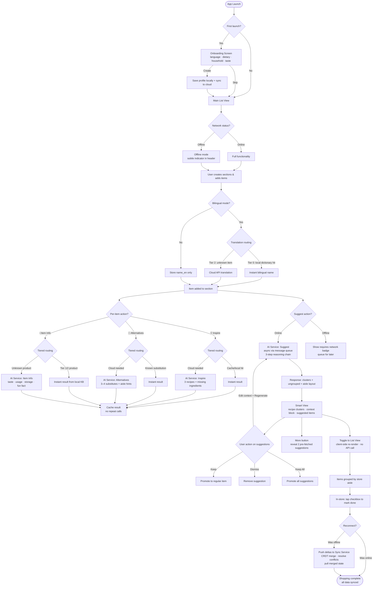

# PRD_V1.0

**Date:** February 14, 2026 (Updated: February 24, 2026)
**Platform:** React Native (Mobile) + Microservices Backend + On-Device Local Agent

---

## 1. Overview

A grocery shopping assistant modeled after Apple Reminders' Groceries list. Users maintain a single, section-based grocery list and get AI-powered suggestions per section to fill gaps, remind forgotten items, and recommend complementary products. Beyond list-building, the app serves as a portable product encyclopedia — a "Wikipedia of Costco" that lives on your phone — helping users understand unfamiliar products through taste profiles, usage instructions, cultural context, and local substitutes, even without internet.

**Core problem:** Shoppers who are unfamiliar with certain grocery products — whether they are new to a country, exploring a different cuisine, or simply buying something outside their usual routine — enter stores with incomplete lists. They forget items, miss pairings, don't know what local products are or how to use them, and can't find culturally familiar ingredients. In-store, connectivity is often poor, and existing recommendation systems optimize for merchant revenue, not shopper needs.

**Core value proposition:** A familiar, minimal list interface enhanced with smart suggestions and product knowledge — like a knowledgeable local friend shopping alongside you, even when you're offline.

**Benchmark:** Apple Reminders — Groceries. Match its simplicity; add intelligence and offline resilience.



---

## 2. Goals

1. Help users build complete shopping lists from partial ones, reducing forgotten items and food waste.
2. Deliver high-quality, context-aware suggestions per section that feel helpful, not promotional.
3. Educate users on unfamiliar products — taste, usage, cultural context, and local alternatives — instantly, even offline.
4. Support multilingual users natively across English, Simplified Chinese, and French.
5. Keep the interface as simple as Apple Reminders — zero learning curve.
6. Provide reliable in-store functionality regardless of network conditions. Core features (checklist, item info, aisle navigation) must work offline.
7. Minimize AI token costs through tiered inference — serve from local data first, escalate to cloud only when necessary.
8. Ship a production-ready mobile app backed by a microservices architecture demonstrating distributed systems concepts (service discovery, async messaging, data replication, fault tolerance).

---

## 3. Target Users

- **Shoppers unfamiliar with certain products:** Anyone encountering unfamiliar grocery items — whether they are new to a country, exploring a different cuisine, or simply buying something outside their usual routine. This is the primary insight behind the product.
- **Small-household shoppers (1–2 people):** Shop at bulk stores like Costco. Prone to waste. Plan loosely.
- **Busy planners:** Know a few items but don't build full lists.

### Target Scenarios (V2 focus)

1. **Shopper unfamiliar with local products** — doesn't know what an item tastes like, how to use it, or where to find it. The app educates on items, suggests culturally relevant recipes, and finds local substitutes for hard-to-find ingredients.
2. **Weekly restock for a 1–2 person household** — buys across categories, wastes perishables. The app suggests complementary items in the right amounts.
3. **"I have a few items, help me round out the trip"** — knows they want chicken and rice, hasn't thought beyond that. The app fills the gaps.
4. **In-store with poor connectivity** — user is in Costco, sees "Ranch Dressing" on the shelf, doesn't know what it is. Taps Item Info and gets an instant answer from the local knowledge base. Checks off items, adjusts quantities, and navigates aisles — all without network. Changes sync automatically when back online.

---

## 4. User Stories

| ID | Module | User Story | Priority |
| --- | --- | --- | --- |
| US-1 | Onboarding & Profile | As a shopper, I want to set my dietary restrictions, household size, taste preferences, and preferred language so the app personalizes suggestions and displays content in my language. | Must |
| US-2 | List Building | As a shopper, I want to create sections (e.g., "Costco", "BBQ Weekend") to organize my list by store, occasion, or theme. | Must |
| US-3 | List Building | As a shopper, I want to add items with a name and quantity (default: 1), and have items auto-translated if I type in another language. | Must |
| US-4 | List Building | As a shopper, I want to edit item names inline, adjust quantities, check off items, and delete items. | Must |
| US-5 | List Building | As a shopper, I want to rename, delete, and collapse sections. | Must |
| US-6 | Smart Suggestions | As a shopper, I want to tap "Suggest" on a section to get AI-recommended items organized into recipe clusters based on my full list and profile. | Must |
| US-7 | Smart Suggestions | As a shopper, I want to keep, dismiss, or keep all suggested items directly within the recipe clusters. | Must |
| US-8 | Smart Suggestions | As a shopper, I want to tap "Alternatives" on any item to find local substitutes and swap the item in place. | Must |
| US-9 | Smart Suggestions | As a shopper, I want to edit the recommendation context and regenerate if suggestions feel off. | Should |
| US-10 | Smart Suggestions | As a shopper, I want a "More" button to reveal up to 2 additional pre-fetched suggestions. | Should |
| US-11 | In-Store Mode | As a shopper, I want to switch to List View after Suggest runs so my items are organized by store aisle for efficient in-store navigation. | Must |
| US-12 | In-Store Mode | As a shopper, I want to check off items while shopping, with checked items visually struck through. | Must |
| US-13 | Per-Item Education | As a shopper, I want to tap "Inspire" on any item to get recipe ideas and add missing ingredients to my list. | Must |
| US-14 | Per-Item Education | As a shopper, I want to tap "Item Info" on any item to learn about its taste, usage, and storage. | Should |
| US-15 | Offline Mode | As a shopper in-store with poor network, I want my checklist, item info, and aisle navigation to work without internet so I am not blocked by connectivity. | Must |
| US-16 | Offline Sync | As a shopper returning from the store, I want my offline changes to sync automatically when I regain connectivity without losing any edits. | Must |
| US-17 | Offline Sync | As part of a household, I want changes made by my partner at home to merge with my in-store changes without conflicts. | Should |
| US-18 | Local Intelligence | As a shopper, I want the app to answer basic product questions (translation, item info, aisle location) instantly from on-device data, without using my data plan. | Should |

---

## 5. Functional Requirements

### 5.1 Onboarding & Profile

**US-1: Onboarding & Profile Setup**

**As** a first-time user,
**I want to** set my language, dietary restrictions, household size, and taste preferences during onboarding,
**So that** the app personalizes all suggestions and displays content in my preferred language from the start.

**Acceptance Criteria:**

- On first launch, a welcome screen presents four inputs: language selector (English only / English + 简体中文 / English + Français), dietary restriction chips (multi-select), household size selector (1 / 2 / 3 / 4+), and a free-text taste preferences field.
- "Create" saves the profile and proceeds to the main view.
- "Skip" proceeds directly to the main view without saving. No nudge is shown.
- Profile data persists across sessions and syncs to cloud.

**Functional Requirements:**

- FR-1: On first launch, display a welcome screen titled "Welcome to Smart Grocery."
- FR-2: The welcome screen must include: dietary restriction chips (multi-select, e.g., vegetarian, gluten-free, nut allergy), household size selector (1, 2, 3, 4+), taste preferences (free-text input), and a language selector.
- FR-3: The language selector must offer three options: "English only", "English + 简体中文", and "English + Français."
- FR-4: Two actions at the bottom: "Create" (saves profile and proceeds) and "Skip" (proceeds directly without saving and without any nudge).
- FR-5: Profile data must persist locally and sync to the cloud backend.

---

### 5.2 List Building

**US-2–5: List Building with Auto-Translation**

**As** a shopper,
**I want to** add items in any language and have them auto-translated into my active language pair,
**So that** my list stays consistent regardless of what language I think in.

**Acceptance Criteria:**

- Each section has an inline text input for adding items. A new item is created with a name and quantity defaulting to 1.
- If the user's language preference is bilingual, the app translates the item on add — checking the local bilingual dictionary first, falling back to the cloud API for unknown items.
- Items display bilingual names (e.g., "Chicken Breast / 鸡胸肉") with the secondary language visually subordinate.
- Quantity is editable directly on the item. Users can edit item names inline, delete items, and check items off (strikethrough).
- Users can create, rename, delete, and collapse sections.
- All data persists across sessions and survives offline periods without data loss.

**Functional Requirements:**

- FR-6: The main view displays a single list organized by user-created sections. Each section has a header (user-defined name) and contains items beneath it.
- FR-7: Action buttons in the top-right corner: (1) Create Section — adds a new section header, (2) Edit Preferences — opens profile editing.
- FR-8: On first launch (before the user adds anything), display sample data to demonstrate the app's structure:
Sample data is clearly labeled and removable once the user creates their own content.
    
    ```
    Costco (sample)  Apple  ChickenOther  Noodle
    ```
    
- FR-9: Each item displays its name and quantity. If the user's language preference is bilingual, items display both the English name and the translated name (e.g., "Chicken Breast / 鸡胸肉").
- FR-10: Each item has a quantity field, defaulting to 1. The user can increase or decrease the quantity directly on the item.
- FR-11: Each item has a checkbox (left side). Tapping it strikes through the item, marking it as done.
- FR-12: Each item has action controls to delete the item and access per-item AI features (Inspire, Alternatives, Item Info — see Section 5.5).
- FR-13: Users must be able to edit item names inline.
- FR-14: Users must be able to rename and delete sections.
- FR-15: Sections are collapsible (tap section header to expand/collapse).
- FR-16: All list data (sections, items, quantities, checked states) must persist locally and sync to cloud. Data must survive offline periods without loss.
- FR-17: When the user adds an item and the language preference is bilingual, the app routes through the tiered inference system: check the local bilingual dictionary (Tier 0) first; if not found, call the cloud API (Tier 2). Input in any language is accepted — the system returns both `name_en` and the secondary language name.

---

### 5.3 Smart Suggestions

**US-6–10: AI-Powered Smart Suggestions with Recipe Clustering**

**As** a shopper with a partial list,
**I want to** tap "Suggest" on a section and see my items reorganized into recipe clusters with new recommendations woven in,
**So that** I immediately understand why an item is recommended and what I can cook with it.

**Acceptance Criteria:**

- Tapping "Suggest" sends all items across all sections, user profile, and section context to the AI Service.
- The response organizes existing items into 2–4 recipe clusters (e.g., "Tomato Pork Noodle Soup"), each with a name, short description, and items.
- Each cluster includes 1–2 suggested new items placed alongside the existing items they pair with.
- A context block above the clusters summarizes the reasoning (e.g., "Your list has vegetables and carbs but needs protein"). The context block is editable; tapping "Regenerate" triggers a new API call.
- Suggested items are visually distinct (dashed border, sparkle icon) with a one-line reason capped at 15 words.
- User can Keep (promotes to regular item), Dismiss (removes suggestion), or Keep All (accepts all suggestions at once).
- A "More" button reveals up to 2 additional pre-fetched suggestions, then disappears.
- Suggest requires network connectivity. When offline, the Suggest button displays a "requires network" indicator.

**Functional Requirements:**

### Triggering

- FR-18: Each section header displays a "Suggest" button.
- FR-19: Tapping "Suggest" triggers the recommendation flow for that section. If the device is offline, display a brief message indicating network is required and do not submit the request.

### Cross-Section Awareness

- FR-20: The recommendation engine must consider items across ALL sections to: (a) avoid suggesting items already present in other sections, (b) identify forgotten items that pair with items in other sections, (c) produce more holistic suggestions.

### Recommendation Logic (3-Step Reasoning Chain)

- FR-21: One AI Service call is made per "Suggest" tap. The request includes: all items across all sections (with bilingual names where available), the user profile, and the target section name. The request is processed asynchronously via the message queue.
- FR-22: The AI prompt uses a 3-step internal reasoning chain: (1) **Gap analysis** — identify what is missing given what the user already has; (2) **Cultural match** — align suggestions with the user's stated preferences and background; (3) **Recipe bridge** — group suggested items into coherent meal or recipe clusters where possible.
- FR-23: The API response returns a structured JSON object containing recipe clusters (each with a name, description, and list of items marked as either existing or new suggestions) and an ungrouped list for items that do not fit a cluster. Each item includes a bilingual name and a one-line reason.
- FR-24: The system pre-fetches enough suggestions to support both the initial display and the "More" batch in a single API call. No additional API call is made when the user taps "More."

### Presentation — Smart View (Default After Suggest)

- FR-25: After "Suggest" runs, the section switches to Smart View by default.
- FR-26: Smart View displays recipe-based clusters. Each cluster shows a name, short description, and its items. Items already in the user's list are shown as existing; suggested items are visually distinct (dashed border, tinted background).
- FR-27: An ungrouped section displays items that do not belong to any specific cluster.
- FR-28: Above the clusters, an editable context block displays the recommendation reasoning. Auto-generated from section name, item count, and user profile. User edits override it.
- FR-29: The user can edit the context block and tap "Regenerate" to get new suggestions (triggers a new API call).
- FR-30: A "Keep All" button appears when at least one suggested item is visible. Tapping it promotes all suggested items to regular items.
- FR-31: A "More" button reveals up to 2 additional pre-fetched suggestions, then disappears.

### User Actions on Suggestions

- FR-32: Each suggested item has two actions: (a) Keep — promotes it to a regular item, (b) Dismiss — removes it from view.
- FR-33: Suggestions that are neither kept nor dismissed remain visible until the user acts on them or starts a new suggestion cycle.

---

### 5.4 In-Store Mode

**US-11–12: In-Store Mode (List View)**

**As** a shopper heading into the store,
**I want to** switch my section to List View so items are organized by store aisle,
**So that** I can move through the store efficiently without backtracking.

**Acceptance Criteria:**

- After "Suggest" runs, a toggle appears on the section allowing the user to switch between Smart View (recipe clusters) and List View (store aisles).
- List View organizes all items — both user-added and kept suggestions — into aisle categories (e.g., "Produce", "Meat & Seafood", "Dry Goods & Pantry").
- Aisle categorization is returned by the same Suggest API call — no additional API call is made on toggle. If Suggest has not been run, aisle categories are derived from the local product knowledge base.
- Items in List View display bilingual names, quantities, checkboxes, and per-item education buttons.
- Checking off an item strikes it through in both List View and Smart View.
- List View is fully functional offline.

**Functional Requirements:**

- FR-34: After "Suggest" runs, the user can toggle the section between Smart View and List View.
- FR-35: List View organizes all items by store aisle categories (e.g., "Produce", "Meat & Seafood", "Dry Goods & Pantry", "Dairy & Eggs"). Aisle categorization is returned by the Suggest API response. If Suggest has not been run, aisle categories are looked up from the local product knowledge base on device.
- FR-36: Items in List View display bilingual names, quantities, checkboxes, and per-item AI feature buttons.
- FR-37: Checking off an item in either view marks it as done across both views.

---

### 5.5 Per-Item Education

**US-13–14: Per-Item Education (Inspire, Alternatives, Item Info)**

**As** a shopper unfamiliar with a product,
**I want to** tap an education button on any item to learn about it, find recipes, or discover local substitutes,
**So that** I can confidently decide whether to buy it and how to use it.

**Acceptance Criteria:**

- Each item displays three icon badges: 💡 Inspire, 🔄 Alternatives, ℹ️ Item Info.
- **Inspire:** Returns 3 recipe ideas using that item. Each recipe includes a name, short description, and list of missing ingredients. An "Add All" button adds the missing ingredients to the current section (with auto-translation if bilingual). Requires network for full results; a basic version may be served from the local model when offline.
- **Alternatives:** Returns 3–4 local substitutes with a match level (e.g., "Very close"), a short comparison description, and an aisle hint. A "Use This" button replaces the original item in place. Routes through tiered inference: known substitution mappings are served locally; unknown items escalate to cloud.
- **Item Info:** Returns educational content — taste profile, common uses, how to pick it, storage tips, and a fun or cultural fact. Displayed in the user's active language. Routes through tiered inference: Tier 1 and Tier 2 products are served from the local knowledge base; unknown products escalate to cloud.
- All three features cache results on first tap. Repeat taps do not fire new API calls.

**Functional Requirements:**

### Inspire (💡)

- FR-38: Each item displays an "Inspire" button (💡).
- FR-39: Tapping "Inspire" routes through the tiered inference system. If a cached or local result is available, it is returned immediately. Otherwise, the request escalates to the cloud AI Service. Returns 3 recipe ideas that use that item, each with a name, short description, and a list of additional ingredients needed.
- FR-40: Each recipe idea includes an "Add All" button that adds the missing ingredients to the current section (with auto-translation if the user is in bilingual mode).
- FR-41: Inspire results are displayed as an expandable panel beneath the item and cached after first retrieval.

### Alternatives (🔄)

- FR-42: Each item displays an "Alternatives" button (🔄).
- FR-43: Tapping "Alternatives" routes through the tiered inference system. Known substitution mappings (stored in the local knowledge base) are returned immediately. For items without local mappings, the request escalates to the cloud AI Service. Returns 3–4 local substitute products, each with: a match level (e.g., "Very close", "Similar", "Different but works"), a short comparison description, and an aisle hint.
- FR-44: Each alternative includes a "Use This" button that replaces the original item in the list in place (updating its name and bilingual translation).
- FR-45: Alternatives results are displayed as an expandable panel beneath the item and cached after first retrieval.

### Item Info (ℹ️)

- FR-46: Each item displays an "Item Info" button (ℹ️).
- FR-47: Tapping "Item Info" routes through the tiered inference system. Tier 1 products (full-detail entries in the local knowledge base) return instant results with taste profile, common uses, how to pick, storage tips, and a cultural or fun fact. Tier 2 products return bilingual name and aisle location only. Unknown products escalate to the cloud AI Service.
- FR-48: Item Info results are displayed as an expandable panel beneath the item and cached after first retrieval.
- FR-49: Item Info content is displayed in the user's active language (bilingual if set).

---

### 5.6 Offline Mode & Local Agent

**US-15, US-18: Offline Functionality**

**As** a shopper in-store with poor connectivity,
**I want to** use core app features without internet,
**So that** I can shop efficiently regardless of network conditions.

**Acceptance Criteria:**

- The app detects network status and displays a subtle connectivity indicator (e.g., a small icon in the header). The indicator is informational only — it never blocks the user.
- All list management features (add, edit, check off, delete items; create, rename, collapse sections) work fully offline.
- Item Info, Alternatives, and aisle navigation work offline for products in the local knowledge base (Tier 1 and Tier 2).
- Translation works offline for items in the local bilingual dictionary.
- Suggest and complex Inspire requests require network. When offline, these buttons show a subtle "requires network" badge. Tapping them queues the request for when connectivity returns.
- The app never shows a blocking error screen due to lack of connectivity.

**Functional Requirements:**

### Connectivity Awareness

- FR-50: The app monitors network status continuously and exposes it to all features via a shared connectivity state.
- FR-51: A subtle connectivity indicator appears in the app header when the device is offline (e.g., a small cloud-with-slash icon). When online, no indicator is shown.
- FR-52: The connectivity indicator is informational only. It must never block user interaction or present a modal.

### Offline-Capable Features

- FR-53: List management (add, edit, delete, check off items; create, rename, delete, collapse sections) must work fully offline. All changes are saved to local storage and queued for sync.
- FR-54: Item Info for Tier 1 products (full-detail entries, ~1,000 items) is served from the on-device SQLite knowledge base with no network required.
- FR-55: Item Info for Tier 2 products (bilingual name + aisle location, ~5,000 items) is served from the on-device SQLite knowledge base with no network required. Content is limited to name, translation, and aisle — no taste or cultural detail.
- FR-56: Alternatives for products with known substitution mappings in the local knowledge base are served offline.
- FR-57: Translation for items present in the local bilingual dictionary is served offline. Unknown items are queued for cloud translation when connectivity returns, displaying the user's original input in the meantime.
- FR-58: Aisle navigation (List View categorization) is served from local aisle mappings for known products.

### Network-Required Features

- FR-59: Suggest (recipe clustering) requires network. When offline, the Suggest button displays a subtle "requires network" badge.
- FR-60: Complex Inspire requests (creative recipes for products not in local KB) require network. Basic Inspire for well-known products may be served from the local model (Tier 1) in future iterations.
- FR-61: When a network-required feature is tapped while offline, the app displays a brief, non-blocking message (e.g., toast: "This feature needs internet. We'll process it when you're back online."). The request is queued if applicable.

### Tiered Inference Routing

- FR-62: All AI-powered features route through a tiered inference system. The routing order is:
    1. **Tier 0 — Local lookup:** Check on-device cache (previously fetched results) and SQLite knowledge base. Instant, zero cost.
    2. **Tier 1 — Local model (future):** On-device model (OpenClaw or equivalent) handles simple inference tasks (basic translation, simple item info generation). Near-instant, zero API cost. Initially stubbed — architecture supports it, implementation deferred.
    3. **Tier 2 — Cloud AI:** Claude API via the backend AI Service. 2–5s latency, pay-per-call. Used for complex tasks (Suggest, creative Inspire, culturally nuanced Alternatives).
- FR-63: The routing decision is transparent to the user. The UI does not indicate whether a response came from the local KB or the cloud.

### Local Knowledge Base

- FR-64: The app maintains an on-device SQLite database containing the product knowledge base.
- FR-65: The knowledge base uses a tiered content strategy:
    - **Tier 1 (~1,000 items):** Full detail — bilingual names, taste profile, common uses, how to pick, storage tips, cultural note, aisle location, known substitutions. Focus: products that immigrants and international students commonly find unfamiliar (e.g., ranch dressing, maple syrup, baking soda, specific meat cuts).
    - **Tier 2 (~5,000 items):** Bilingual name mapping + aisle location only. Focus: common products that need translation but not explanation.
    - **Tier 3 (everything else):** No local entry. Escalates to cloud.
- FR-66: The knowledge base syncs from the cloud Knowledge Service periodically when on WiFi. Initial sync downloads the full Tier 1 + Tier 2 dataset (~10–20 MB). Subsequent syncs are incremental (only items updated since last sync).
- FR-67: The app must not initiate knowledge base sync over cellular data unless the user explicitly opts in.

---

### 5.7 Data Synchronization

**US-16–17: Offline Sync & Conflict Resolution**

**As** a shopper whose device was offline,
**I want** my changes to merge seamlessly with the cloud when I reconnect,
**So that** I never lose edits and my list stays consistent across devices.

**Acceptance Criteria:**

- When the device regains connectivity, all offline changes sync to the cloud automatically within 10 seconds.
- Changes made by another device (e.g., a partner editing the shared list at home) merge with local changes without data loss.
- The user is not asked to resolve conflicts manually. The system uses deterministic merge rules.
- After sync, both devices see the same list state.

**Functional Requirements:**

### Delta-Based Sync

- FR-68: While offline, every list mutation is recorded as a delta in a local delta store. Each delta includes: a unique event ID, the operation type, the payload, a vector clock, and a timestamp.
- FR-69: When connectivity is restored, the app pushes all pending deltas to the Sync Service in order.
- FR-70: The Sync Service merges incoming deltas with the cloud state using CRDT (Conflict-free Replicated Data Type) merge rules and returns the merged list state to the client.
- FR-71: The client replaces its local list state with the merged result and clears the delta store.

### Conflict Resolution Rules

- FR-72: For scalar fields (item name, quantity, checked state): Last-Writer-Wins (LWW) based on vector clock comparison. If vector clocks are concurrent (neither dominates), timestamp is used as a tiebreaker.
- FR-73: For item collections (items within a section): OR-Set semantics. Add wins over delete — if one device adds an item while another deletes it, the item is preserved.
- FR-74: For section deletion conflicts: if one device deletes a section while another adds an item to it, the section is re-created with the new item.
- FR-75: Conflict resolution is fully deterministic. No user intervention is required.

### Sync Triggers

- FR-76: Sync triggers automatically when: (a) the device transitions from offline to online, (b) a push notification is received indicating remote changes, (c) the app is foregrounded after being backgrounded for > 1 minute.
- FR-77: While online, list changes sync in near-real-time via WebSocket. The delta store is used only when the WebSocket connection is unavailable.

---

## 6. Non-Goals (Out of Scope for V2)

- Product discovery/explorer feature.
- Real-time store inventory or pricing data.
- Shared/collaborative lists with permissions and access control.
- Purchase history tracking or analytics.
- Auto-restock predictions.
- Languages beyond English, Simplified Chinese, and French.
- Full AI suggestion quality offline (Suggest requires cloud for recipe clustering).
- On-device LLM inference (Tier 1 architecture is defined; implementation deferred to future phase).
- Drag-and-drop item reordering between sections.
- Store-specific product recommendations (e.g., specific brand suggestions).

---

## 7. Design Considerations

- **Benchmark:** Apple Reminders — Groceries list. Match its simplicity in layout, interactions, and information density.
- **Style:** Minimalist, fresh. Clean white base, soft green accents, one sans-serif font family. Generous whitespace, rounded corners.
- **Platform:** React Native mobile app. Mobile-first layout, single-hand usable in-store.
- **Touch targets:** Large enough for in-store use with one hand.
- **Bilingual display:** When bilingual mode is active, item names display as "English / 中文" or "English / Français" inline. Secondary language text is visually subordinate (smaller, lighter color) but always present.
- **Suggestions visual treatment:** Must be visually distinct from user-added items but not disruptive. Subtle background tint or dashed border. Should feel like gentle additions, not intrusions.
- **Smart View clusters:** Recipe cluster cards use a warm tinted background. Each cluster has an emoji + name header and a short description line.
- **Per-item feature buttons:** Displayed as compact icon badges next to each item. Expanded panels appear beneath the item without disrupting list flow.
- **Context block:** Rendered as a readable sentence (not a form). Editable on tap. Should feel like a note, not a settings panel.
- **Sample data:** Clearly marked as sample (e.g., "(sample)" label). Removable once the user creates their own content.
- **Offline indicator:** A subtle cloud-with-slash icon in the header when offline. No icon when online. Never a blocking modal or banner.
- **Degraded feature indicators:** Buttons for network-required features (Suggest) show a small badge when offline. The badge disappears when connectivity returns.
- **Local vs. cloud responses:** The user should not perceive a difference between locally served and cloud-served results. No "powered by" labels or source indicators. The experience should feel seamless.

---

## 8. Technical Considerations

### Architecture

The app uses a microservices backend with six services, communicating via gRPC (inter-service) and REST + WebSocket (client-facing). AI processing is handled asynchronously via RabbitMQ. The mobile app acts as an edge node capable of independent operation offline.

**Services:**

1. **API Gateway (Node.js / Fastify)** — routing, JWT auth, rate limiting, WebSocket management, service discovery via Consul.
2. **User Service (Go)** — accounts, profiles, preferences. PostgreSQL.
3. **List Service (Go)** — sections, items, CRDT vector clocks. PostgreSQL.
4. **AI Service (Python FastAPI)** — tiered inference router, async workers, circuit breaker on Claude API. Redis cache.
5. **Knowledge Service (Go)** — product database, bilingual dictionaries, aisle mappings, device sync payloads. PostgreSQL.
6. **Sync Service (Go)** — WebSocket connections, CRDT merge, conflict resolution, real-time push.

**Infrastructure:** PostgreSQL (primary data), Redis (AI response cache), RabbitMQ (async AI jobs + list change events), Consul (service discovery).

### Tiered Inference

All AI features route through a three-tier inference system to minimize latency and token cost:

| Tier | Where | Latency | Cost | Handles |
| --- | --- | --- | --- | --- |
| Tier 0 | On-device SQLite + Redis cache | Instant | Free | Known product lookups, cached results, bilingual dictionary |
| Tier 1 | On-device model / OpenClaw (future) | Near-instant | Free | Simple translation, basic item info generation |
| Tier 2 | Claude API via AI Service | 2–5s | Pay-per-call | Suggest, creative Inspire, culturally nuanced Alternatives |

Routing logic: try Tier 0 → if miss, try Tier 1 → if insufficient or complex, escalate to Tier 2. A circuit breaker on Tier 2 falls back to Tier 1 after 3 consecutive failures.

### On-Device Storage

- **SQLite — Product Knowledge Base:** ~10–20 MB. Synced from Knowledge Service on WiFi. Contains Tier 1 (full detail, ~1K items) and Tier 2 (bilingual names + aisles, ~5K items).
- **SQLite — Delta Store:** Pending offline changes. Each delta carries a vector clock for CRDT merge. Cleared after successful sync.
- **Local list state:** Full copy of sections and items for offline operation.

### Sync Protocol

- **Online:** Changes sync in near-real-time via WebSocket through the Sync Service.
- **Offline:** Changes accumulate as vector-clock-stamped deltas. On reconnect, deltas are pushed to the Sync Service, which merges using LWW registers (scalars) and OR-Sets (item collections). Merged state is pushed back to the client.

### AI Service Async Flow

1. Client taps "Suggest" → request sent to API Gateway.
2. AI Service publishes job to RabbitMQ queue, returns job ID (HTTP 202).
3. AI Worker consumes job, routes through tier logic, calls Claude API if needed.
4. Result published to RabbitMQ results queue.
5. Sync Service consumes result → pushes to client via WebSocket (or client polls).

### Caching

- AI responses cached in Redis. Key pattern: `{feature}:{item_or_user}:{language}:{content_hash}`.
- TTL: 1 hour for Suggest, 24 hours for Inspire/Alternatives/Item Info.
- On-device: per-item results cached locally after first retrieval. Repeat taps cost nothing.

### Token Efficiency

| Action | Tier 0 (Free) | Tier 2 (Paid) | Tokens (Tier 2) |
| --- | --- | --- | --- |
| Translation | Local dictionary hit | Unknown items | ~200 |
| Item Info | Tier 1/2 products | Unknown products | ~600 |
| Alternatives | Known substitutions | Unknown items | ~800 |
| Inspire | — (future: Tier 1 local) | All (for now) | ~800 |
| Suggest | — | Always | ~2,000 |
| View switching | Always (client-side) | Never | 0 |

---

## 9. Dependencies

- React Native (mobile app framework).
- Cloud infrastructure: AWS EKS (Kubernetes), PostgreSQL, Redis, RabbitMQ, Consul.
- Claude API (Anthropic) — Tier 2 AI inference.
- SQLite (on-device knowledge base and delta store).
- gRPC + Protobuf (inter-service communication).
- OpenClaw (future — on-device local model for Tier 1 inference).

---

## 10. Assumptions

1. Users understand the Reminders-style list interaction (checkboxes, sections) without onboarding for the list itself. Sample data is sufficient.
2. A single Claude API call with a structured 3-step reasoning prompt produces better-organized suggestions than a two-layer client-side + API approach.
3. Caching per-item AI results on first tap is sufficient — users rarely need to refresh these within a single session.
4. Smart View (recipe clusters) is more useful at the planning stage; List View (store aisles) is more useful at the in-store stage. Letting users toggle freely covers both phases.
5. Auto-translation on item add is worth the latency because it keeps the list consistent for bilingual users regardless of what language they type in.
6. Users may have intermittent or no connectivity in-store. Core list management and product education must work offline. AI-powered suggestions (Suggest, complex Inspire) require connectivity but degrade gracefully.
7. A curated set of ~1,000 detailed product entries and ~5,000 bilingual name mappings is sufficient to cover the most common "unfamiliar product" encounters for the target user persona.
8. CRDT-based merge with LWW and OR-Set semantics resolves the vast majority of sync conflicts without user intervention.

---

## 11. Success Metrics

| Metric | Target |
| --- | --- |
| Suggestion acceptance rate | ≥ 40% of suggested items are kept |
| "Keep All" usage rate | ≥ 15% of Suggest cycles result in a "Keep All" tap |
| "More" tap rate | ≥ 20% of users tap "More" |
| Context edit rate | < 30% (indicates good auto-inference) |
| Per-item feature engagement | ≥ 25% of sessions include at least one Inspire, Alternatives, or Item Info tap |
| Repeat usage | User triggers "Suggest" on ≥ 3 separate occasions |
| Profile completion | ≥ 60% of users complete profile (not skip) |
| Bilingual mode adoption | ≥ 40% of users select a non-English-only language preference |
| Offline Item Info hit rate | ≥ 70% of in-store Item Info taps served from local KB |
| Sync conflict rate | < 5% of sync events require non-trivial merge |
| Offline session reliability | Users can operate offline for ≥ 30 min without degradation |

---

## 12. V2 Validation Criteria

### List Building

- [ ]  Onboarding: user can set profile (including language) or skip directly; data persists.
- [ ]  Main view: user can create sections and items; sample data shown on first launch.
- [ ]  Items: user can set name and quantity (default 1); can check off and delete items.
- [ ]  Bilingual: typing in any language auto-translates on add; bilingual names display correctly throughout the app.
- [ ]  Sections: user can rename, delete, and collapse sections.

### Smart Suggestions

- [ ]  Suggest: tapping "Suggest" on a section calls the AI Service asynchronously and returns clustered suggestions with a context block.
- [ ]  Smart View: suggestions display as recipe clusters with existing and new items clearly distinguished.
- [ ]  List View: items display organized by store aisle; user can toggle between Smart View and List View.
- [ ]  Keep All: tapping "Keep All" adds all visible suggested items as regular items.
- [ ]  Keep/Dismiss: user can keep individual suggestions (become regular items) or dismiss them.
- [ ]  Edit context: user can modify the context block and regenerate suggestions.
- [ ]  More: tapping "More" reveals up to 2 additional suggestions, then the button disappears.

### Per-Item Education

- [ ]  Inspire: tapping 💡 on an item returns recipe ideas; tapping "Add All" adds missing ingredients to the section.
- [ ]  Alternatives: tapping 🔄 on an item returns local substitutes; tapping "Use This" replaces the item in place.
- [ ]  Item Info: tapping ℹ️ on an item returns educational content about taste, usage, and storage.
- [ ]  Per-item caching: repeat taps on 💡/🔄/ℹ️ do not fire new API calls.
- [ ]  Tiered routing: Item Info for Tier 1 products is served from local KB without network.

### Offline Mode

- [ ]  Airplane mode on → checklist, check-off, quantity changes all work.
- [ ]  Airplane mode on → Item Info returns results for Tier 1 products from local KB.
- [ ]  Airplane mode on → Item Info returns bilingual name + aisle for Tier 2 products from local KB.
- [ ]  Airplane mode on → aisle navigation (List View) works from local aisle mappings.
- [ ]  Airplane mode on → Suggest button shows "requires network" badge; tapping shows a non-blocking toast.
- [ ]  Offline indicator appears in header when offline; disappears when online.

### Data Synchronization

- [ ]  Airplane mode off → offline changes sync to cloud within 10 seconds.
- [ ]  Two devices edit the same list offline → merge produces no data loss.
- [ ]  Item added on one device while deleted on another → add wins (item preserved).
- [ ]  All data (profile, sections, items, quantities, checked states) persists across sessions and survives offline periods.

---

## 13. Future Phases (Reference Only)

- **Phase 2:** On-device LLM inference (OpenClaw / Tier 1). Enable basic Inspire and smart translation offline.
- **Phase 3:** Store-specific suggestions with real pricing and deal data.
- **Phase 4:** Product discovery/explorer feature (social-proof-based).
- **Phase 5:** Shared lists with permissions, household coordination, purchase history.
- **Phase 6:** Auto-restock predictions based on usage patterns.
- **Phase 7:** Expand language support beyond English, Simplified Chinese, and French.
- **Phase 8:** Kafka event streaming for list event sourcing and analytics pipeline.