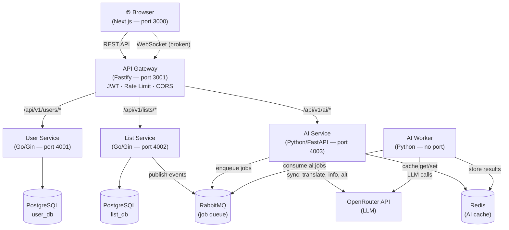
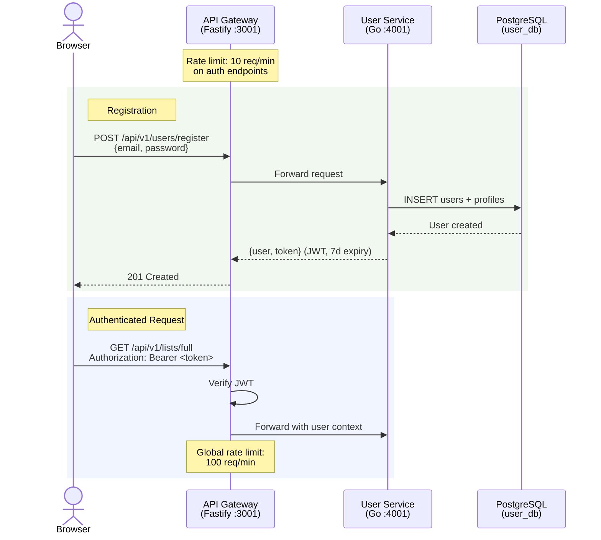
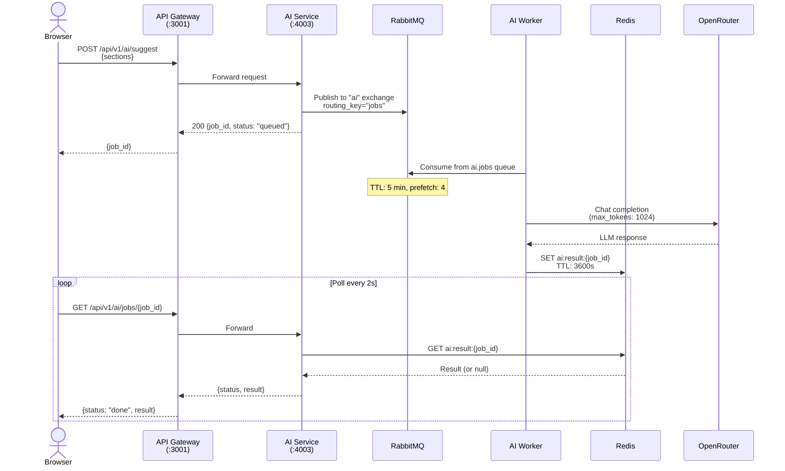
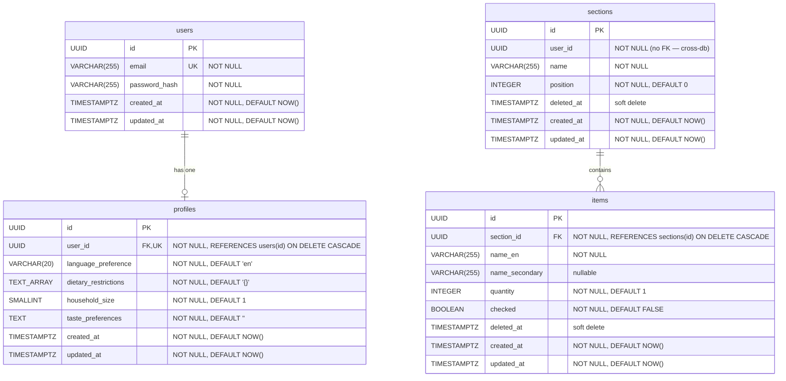

# Phase 1 — Technical Documentation

**Date:** 2026-03-19
**Branch:** `feat/phase1-web`
**Summary:** Web-first MVP delivering list management and AI-powered grocery suggestions via a microservices backend.

---

## Architecture Overview

Phase 1 pivoted from the PRD's mobile-first React Native plan to a **web-first** approach using Next.js. This lets the team validate core flows (list building, AI suggestions) in a browser before investing in native mobile infrastructure.

**Key decisions:**

- **Fastify** as the API Gateway — lightweight, plugin-based, handles JWT auth, rate limiting, CORS, and HTTP proxying to downstream services.
- **Go (Gin)** for data services (User Service, List Service) — fast, statically typed, straightforward CRUD.
- **Python (FastAPI)** for the AI Service — aligns with the AI/ML ecosystem; uses the OpenAI SDK pointed at OpenRouter.
- **OpenRouter** instead of direct Anthropic API — provides model flexibility. Currently configured for `qwen/qwen3-235b-a22b-2507`.
- **Async job processing** — Suggest and Inspire are long-running AI calls. The AI Service enqueues jobs to RabbitMQ; a dedicated worker process consumes them, calls the LLM, and writes results to Redis. The client polls for completion.

**Intentionally omitted from Phase 1:**

| Component | PRD Reference | Reason |
|---|---|---|
| Knowledge Service | Section 8, Service #5 | No on-device SQLite KB in web-first approach |
| Sync Service | Section 8, Service #6 | No offline/CRDT sync needed for web MVP |
| gRPC (inter-service) | Section 8 | REST is simpler for Phase 1; all calls are gateway → service |
| Consul (service discovery) | Section 8 | Static URLs via env vars; no dynamic discovery needed |
| Mobile app (React Native) | Entire PRD | Deferred — web-first pivot |
| Offline mode | Section 5.6 | Not applicable to web client |

---

## System Architecture



> **Note:** The Gateway has WebSocket relay code (`/ws`) that proxies to the List Service. However, the List Service does not expose a `/ws` endpoint — the upstream connection always fails. WebSocket-based real-time updates are non-functional.

---

## Auth Flow



---

## Async AI Job Flow



> **Note:** The PRD envisioned results flowing through an `ai.results` RabbitMQ queue → Sync Service → WebSocket push. In Phase 1, the worker writes directly to Redis and the client polls the AI Service for results.

---

## ER Diagram



**Database Notes:**

| Detail | Description |
|---|---|
| **Two databases** | `user_db` (users, profiles) and `list_db` (sections, items) — separate PostgreSQL databases on the same server |
| **Cross-db boundary** | `sections.user_id` references a user in `user_db` but has no FK constraint (cross-database FKs are not supported in PostgreSQL) |
| **Soft deletes** | Both `sections` and `items` have a `deleted_at` column for soft deletion |
| **Indexes** | `idx_profiles_user_id` on `profiles(user_id)`, `idx_sections_user_id` on `sections(user_id)`, `idx_items_section_id` on `items(section_id)` |
| **Extensions** | `pgcrypto` enabled in `user_db` for `gen_random_uuid()` |

---

## Service Breakdown

### API Gateway

| Property | Value |
|---|---|
| **Language** | TypeScript |
| **Framework** | Fastify 5.7.4 |
| **Port** | 3001 |
| **Responsibilities** | JWT authentication, rate limiting, CORS, HTTP proxying to downstream services, WebSocket relay (broken) |
| **Key Dependencies** | `@fastify/jwt`, `@fastify/rate-limit`, `@fastify/cors`, `@fastify/reply-from`, `@fastify/websocket` |

### User Service

| Property | Value |
|---|---|
| **Language** | Go 1.25.6 |
| **Framework** | Gin |
| **Port** | 4001 |
| **Database** | PostgreSQL — `user_db` |
| **Responsibilities** | User registration, login (JWT issuance), profile CRUD |
| **Key Dependencies** | `gin`, `pgx/v5`, `golang-jwt/jwt/v5`, `x/crypto` (bcrypt) |

### List Service

| Property | Value |
|---|---|
| **Language** | Go 1.25.6 |
| **Framework** | Gin |
| **Port** | 4002 |
| **Database** | PostgreSQL — `list_db` |
| **Responsibilities** | Section CRUD, item CRUD, publish list-change events to RabbitMQ |
| **Key Dependencies** | `gin`, `pgx/v5`, `golang-jwt/jwt/v5`, `amqp091-go` |

### AI Service

| Property | Value |
|---|---|
| **Language** | Python 3.12 |
| **Framework** | FastAPI 0.115.0 |
| **Port** | 4003 |
| **Responsibilities** | Sync AI endpoints (translate, item-info, alternatives), async job submission (suggest, inspire), job status polling |
| **Key Dependencies** | `openai` (pointed at OpenRouter), `redis`, `aio-pika`, `python-jose` |

### AI Worker

| Property | Value |
|---|---|
| **Language** | Python 3.12 |
| **Port** | None (background process) |
| **Responsibilities** | Consume jobs from `ai.jobs` queue, call LLM, store results in Redis |
| **Key Dependencies** | Same as AI Service |

### Web Frontend

| Property | Value |
|---|---|
| **Language** | TypeScript |
| **Framework** | Next.js 16.1.6, React 19.2.3 |
| **Port** | 3000 |
| **Styling** | Tailwind CSS 4 |
| **Responsibilities** | UI for list management, AI panel (tabbed: Info, Translate, Alternatives, Suggest, Inspire) |
| **Key Dependencies** | `next`, `react`, `tailwindcss` |

---

## API Endpoint Reference

| Method | Path | Auth | Description |
|---|---|---|---|
| `GET` | `/health` | No | Gateway health check |
| `POST` | `/api/v1/users/register` | No | Create account (rate: 10/min) |
| `POST` | `/api/v1/users/login` | No | Login, receive JWT (rate: 10/min) |
| `GET` | `/api/v1/users/me` | JWT | Get current user + profile |
| `PUT` | `/api/v1/users/me` | JWT | Update profile |
| `GET` | `/api/v1/lists/full` | JWT | Get all sections with items |
| `GET` | `/api/v1/lists/sections` | JWT | List sections |
| `POST` | `/api/v1/lists/sections` | JWT | Create section |
| `PUT` | `/api/v1/lists/sections/:id` | JWT | Update section |
| `DELETE` | `/api/v1/lists/sections/:id` | JWT | Soft-delete section |
| `GET` | `/api/v1/lists/sections/:id/items` | JWT | List items in section |
| `POST` | `/api/v1/lists/sections/:id/items` | JWT | Add item to section |
| `PUT` | `/api/v1/lists/items/:id` | JWT | Update item |
| `DELETE` | `/api/v1/lists/items/:id` | JWT | Soft-delete item |
| `POST` | `/api/v1/ai/translate` | JWT | Translate item name (sync) |
| `POST` | `/api/v1/ai/item-info` | JWT | Get item info (sync) |
| `POST` | `/api/v1/ai/alternatives` | JWT | Get item alternatives (sync) |
| `POST` | `/api/v1/ai/suggest` | JWT | Submit suggest job (async) |
| `POST` | `/api/v1/ai/inspire` | JWT | Submit inspire job (async) |
| `GET` | `/api/v1/ai/jobs/:id` | JWT | Poll async job status/result |
| `GET` | `/ws` | Token query param | WebSocket relay (non-functional) |

---

## Message Queue Topology

### Exchanges

| Exchange | Type | Durable | Purpose |
|---|---|---|---|
| `ai` | direct | Yes | Route AI jobs and results |
| `list` | fanout | Yes | Broadcast list-change events |

### Queues

| Queue | Durable | TTL | Bound Exchange | Routing Key | Consumer |
|---|---|---|---|---|---|
| `ai.jobs` | Yes | 300s (5 min) | `ai` | `jobs` | AI Worker (prefetch: 4) |
| `ai.results` | Yes | 300s (5 min) | `ai` | `results` | **None** — declared but unused |
| `list.events` | Yes | None | `list` | (fanout) | **None** — events published but no consumer exists |

**Notes:**
- `ai.results` was intended for the PRD's result-push pattern (worker → queue → Sync Service → WebSocket). In Phase 1, the worker writes directly to Redis instead.
- `list.events` receives section/item CRUD events from the List Service publisher, but no service consumes them. Messages accumulate until they are manually purged or the queue is deleted.

---

## Deployment

### Option A: Docker Compose

```bash
# 1. Clone and enter the project
git clone <repo-url> && cd SmartGroceryAssistant

# 2. Copy environment template
cp .env.example .env   # Edit .env to set OPENROUTER_API_KEY

# 3. Start all services
docker compose up --build -d

# 4. Access the app
# Web UI:        http://localhost:3000
# API Gateway:   http://localhost:3001
# RabbitMQ UI:   http://localhost:15672 (sga / sga_secret)
```

### Option B: Kubernetes + Tilt (local dev)

```bash
# 1. Prerequisites: minikube, tilt, kubectl
minikube start

# 2. Create secrets from template
cp k8s/secret.yaml.example k8s/secret.yaml
# Edit k8s/secret.yaml with base64-encoded values

# 3. Start Tilt
tilt up

# Tilt port-forwards all services to the same ports as Docker Compose
```

**Port summary:**

| Service | Port |
|---|---|
| Web (Next.js) | 3000 |
| API Gateway | 3001 |
| User Service | 4001 |
| List Service | 4002 |
| AI Service | 4003 |
| PostgreSQL | 5432 |
| Redis | 6379 |
| RabbitMQ (AMQP) | 5672 |
| RabbitMQ (Management) | 15672 |

---

## Local Development Setup

### Prerequisites

- Node.js 20+
- Go 1.25+
- Python 3.12+
- PostgreSQL 16
- Redis 7
- RabbitMQ 3 (with management plugin)
- An OpenRouter API key

### Steps

1. **Start infrastructure** (PostgreSQL, Redis, RabbitMQ):
   ```bash
   # Using Docker for infra only:
   docker compose up postgres redis rabbitmq -d
   ```

2. **Initialize databases:**
   ```bash
   psql -U sga -h localhost -f infra/postgres/init.sql
   ```

3. **Set environment variables** — each service reads from `.env` or environment:
   ```
   JWT_SECRET=<shared-secret>
   POSTGRES_PASSWORD=sga_secret
   REDIS_PASSWORD=redis_secret
   OPENROUTER_API_KEY=<your-key>
   ```

4. **Start User Service:**
   ```bash
   cd services/user-service && go run ./cmd
   # Listening on :4001
   ```

5. **Start List Service:**
   ```bash
   cd services/list-service && go run ./cmd
   # Listening on :4002
   ```

6. **Start AI Service:**
   ```bash
   cd services/ai-service && pip install -e . && uvicorn app.main:app --port 4003
   # Listening on :4003
   ```

7. **Start AI Worker:**
   ```bash
   cd services/ai-service && python worker.py
   # Consuming from ai.jobs queue
   ```

8. **Start API Gateway:**
   ```bash
   cd services/api-gateway && npm install && npm run dev
   # Listening on :3001
   ```

9. **Start Web Frontend:**
   ```bash
   cd web && npm install && npm run dev
   # Listening on :3000
   ```

10. **Open** `http://localhost:3000` in your browser.
