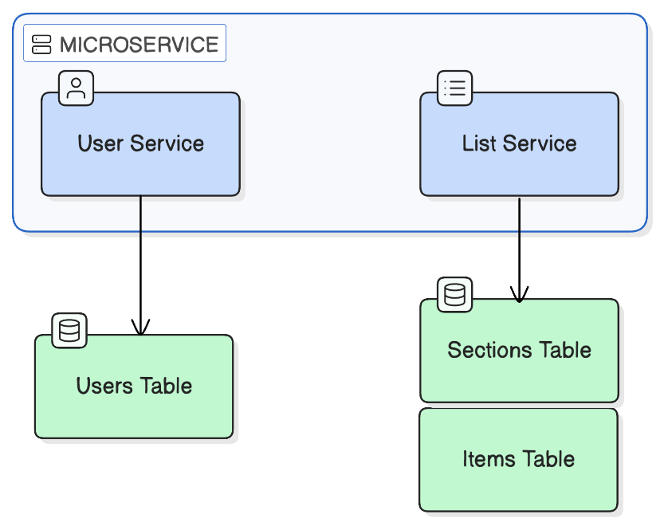
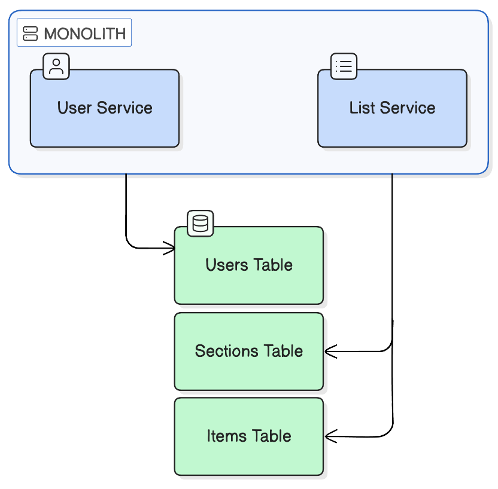
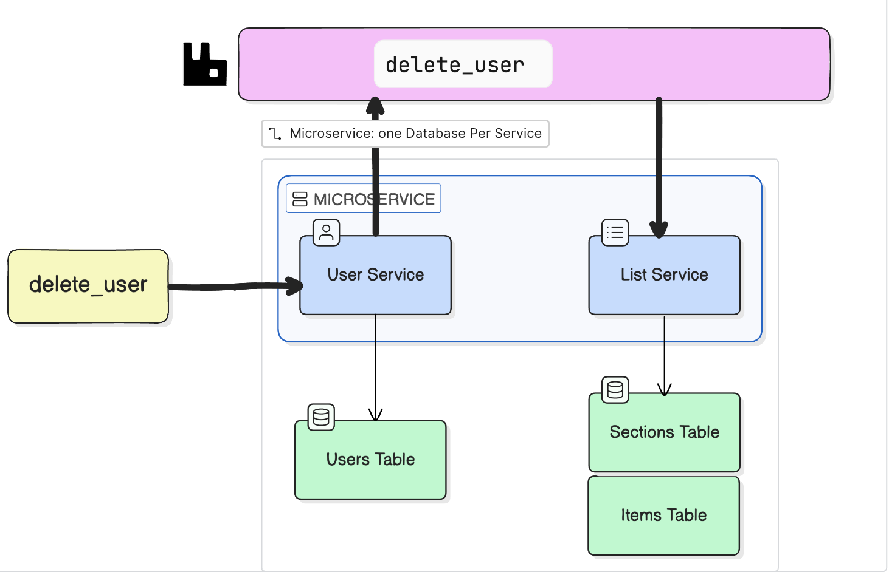
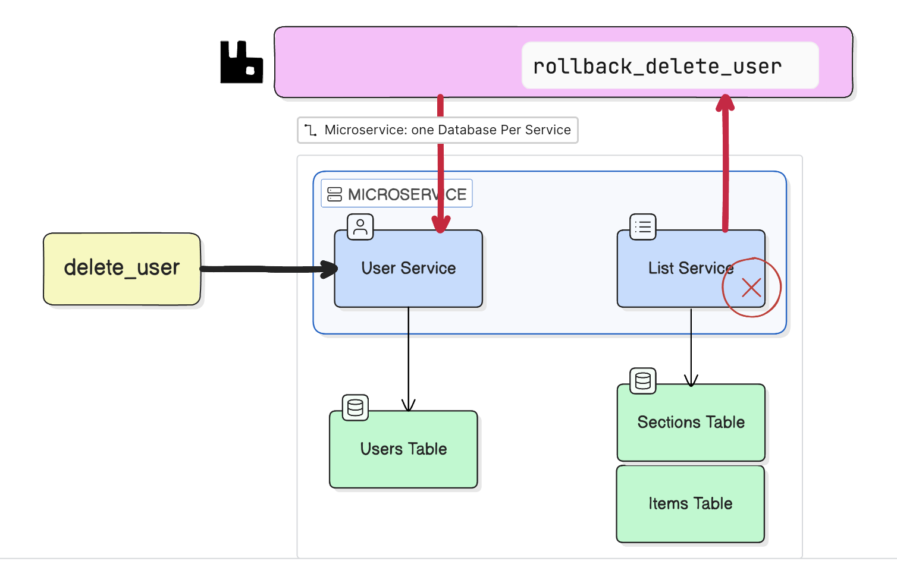
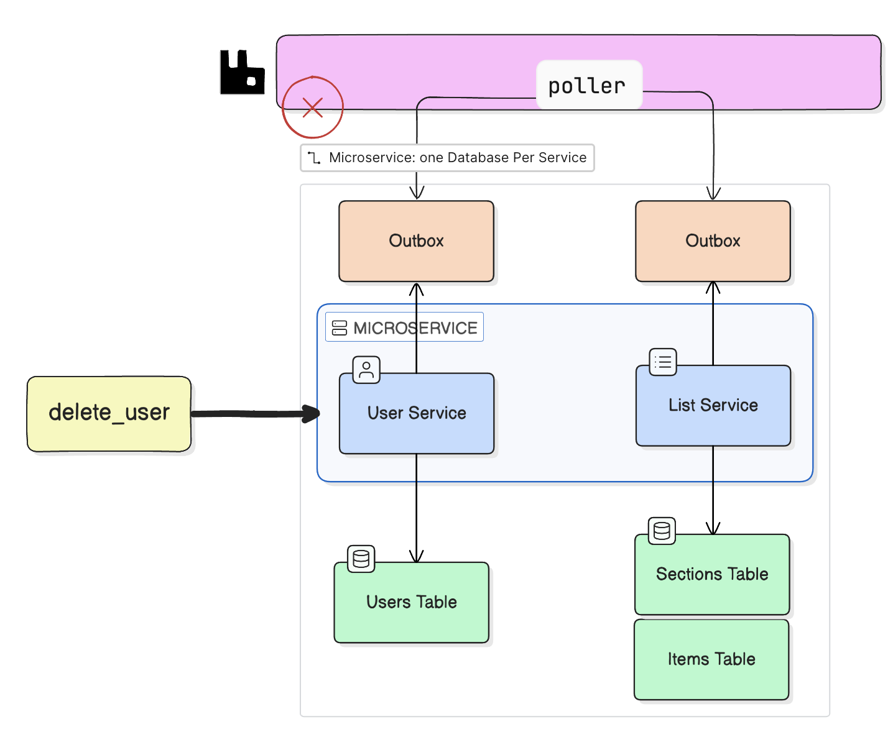
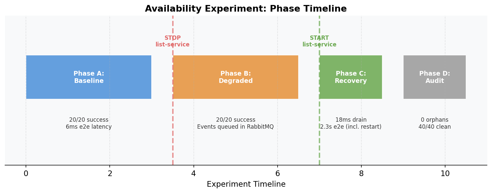
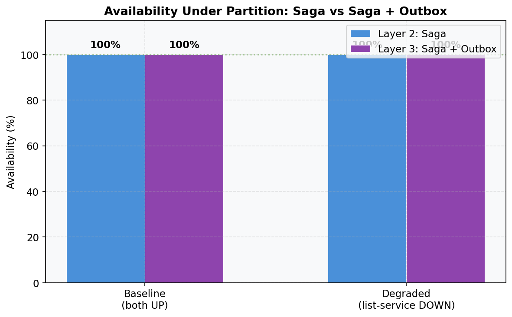
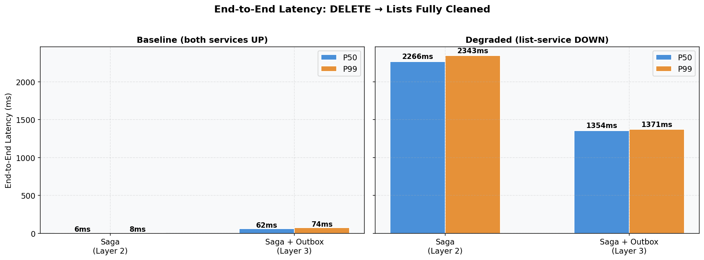
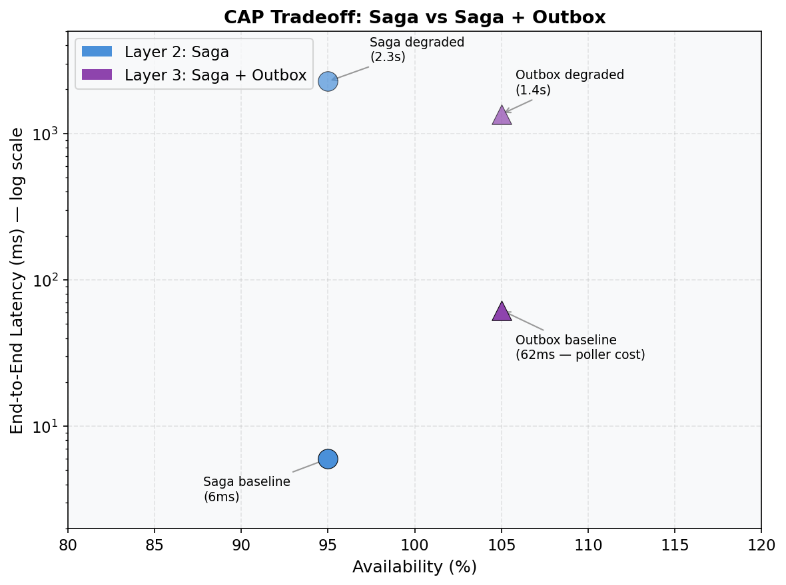

# Data Consistency in Microservices: A Layered Experiment

## SmartGroceryAssistant — Cross-Service User Deletion

**Date:** 2026-04-14
**Authors:** Kaiyue Wei
**Course:** CS6650 — Building Scalable Distributed Systems
**Services Under Test:** user-service (Go/Gin), list-service (Go/Gin)

---

## 1. Problem Statement

In a microservices architecture, each service owns its own database. When a business operation spans multiple services, there is no single transaction that can guarantee atomicity across database boundaries.

**Our concrete problem:** When a user deletes their account, data must be removed from two independent PostgreSQL databases:



```
┌─────────────────────┐          ┌─────────────────────┐
│      user_db        │          │      list_db        │
│                     │          │                     │
│  users    profiles  │          │  sections    items  │
│    │         │      │          │     │          │    │
│    └─CASCADE─┘      │          │     └─CASCADE──┘    │
│                     │          │                     │
│  Owner: user-service│          │  Owner: list-service│
└─────────────────────┘          └─────────────────────┘
         No shared transaction manager
```

**The question:** How do we ensure both databases reach a consistent state when there is no distributed transaction coordinator?

This document explores three progressively sophisticated approaches, each solving the previous one's biggest weakness.

---

## 2. Layer 0: The Monolith Baseline (No Problem Exists)



If both tables lived in one database, this would be trivial:

```sql
BEGIN;
  DELETE FROM users WHERE id = $1;                    -- CASCADE deletes profiles
  UPDATE sections SET deleted_at = NOW()
    WHERE user_id = $1 AND deleted_at IS NULL;
  UPDATE items SET deleted_at = NOW()
    FROM sections s
    WHERE items.section_id = s.id AND s.user_id = $1
      AND items.deleted_at IS NULL;
COMMIT;
```

**Properties:**

- Atomicity: all-or-nothing (ACID)
- Consistency: instant — no window of partial state
- Isolation: other transactions see either the old state or the new state, never a mix
- Durability: committed = permanent

**Why we can't use this:** We chose microservices for independent deployment, scaling, and team ownership. The price is that we lost single-database ACID guarantees across service boundaries.

---

## 3. Layer 1: Two-Phase Commit (2PC)

### 3.1 Theory

Two-Phase Commit is a distributed consensus protocol that extends ACID guarantees across multiple databases. A **coordinator** orchestrates the protocol.

### 3.2 How It Works

```
                         Coordinator
                        ┌───────────┐
                        │           │
              ┌─Phase 1─┤  PREPARE  ├─Phase 1─┐
              │         │           │          │
              ▼         └─────┬─────┘          ▼
        ┌──────────┐          │          ┌──────────┐
        │ user_db  │          │          │ list_db  │
        │          │          │          │          │
        │ Lock row │          │          │ Lock rows│
        │ Write WAL│          │          │ Write WAL│
        │          │          │          │          │
        │ Vote:YES │          │          │ Vote:YES │
        └────┬─────┘          │          └────┬─────┘
             │                │               │
             └──────▶ Collect votes ◀─────────┘
                              │
                    Both YES? │
                    ┌─────────┴─────────┐
                    │                   │
                YES ▼                   ▼ NO (any)
              Phase 2:              Phase 2:
              COMMIT both           ROLLBACK both
```

**Phase 1 — Prepare (Voting):**

1. Coordinator sends `PREPARE` to both databases
2. Each database:
   - Acquires locks on the affected rows
   - Writes all changes to Write-Ahead Log (durable storage)
   - Replies `YES` ("I promise I can commit") or `NO` ("I cannot")
3. A `YES` vote is a **binding promise** — the database guarantees it will not fail on commit

**Phase 2 — Commit/Rollback (Decision):**

1. If ALL voted YES → Coordinator sends `COMMIT` to all
2. If ANY voted NO → Coordinator sends `ROLLBACK` to all
3. Each database executes the decision and releases locks

### 3.3 Why It's Strongly Consistent

The key insight: **no participant commits until the coordinator has collected all votes.**

```
Timeline:
  t0: Both databases lock rows and vote YES
  t1: Coordinator decides COMMIT
  t2: Both databases commit

  At no point between t0 and t2 is one committed and the other not.
  The locks ensure no other transaction can see partial state.
```

There is zero consistency window. Both databases transition from old state to new state as a single logical operation.

### 3.4 Applied to Our User Deletion

```
Coordinator (user-service acting as coordinator):

Phase 1:
  → user_db:  PREPARE "DELETE FROM users WHERE id = X"
  ← user_db:  YES (row locked, WAL written)
  → list_db:  PREPARE "UPDATE sections/items SET deleted_at = NOW()"
  ← list_db:  YES (rows locked, WAL written)

Phase 2:
  → user_db:  COMMIT
  → list_db:  COMMIT
  ← Both:     DONE

Client receives: 204 No Content
```

### 3.5 The Problems

| Problem                | Description                                                                                                                                                                      | Impact                                                              |
| ---------------------- | -------------------------------------------------------------------------------------------------------------------------------------------------------------------------------- | ------------------------------------------------------------------- |
| **Blocking**     | If coordinator crashes between Phase 1 and Phase 2, both databases hold locks indefinitely. No participant can decide on its own — it must wait for the coordinator to recover. | Other users' requests that touch the same rows are**blocked** |
| **Availability** | ALL participants must be reachable. If list-service or list_db is down, user deletion**cannot proceed at all**.                                                            | Violates the independence promise of microservices                  |
| **Latency**      | Minimum 2 network round-trips (prepare + commit) across service boundaries, plus lock hold time                                                                                  | Slower than local operations                                        |
| **Scalability**  | Locks held across services create cross-database contention. Under high concurrency, throughput degrades significantly                                                           | Poor horizontal scaling                                             |
| **Complexity**   | Requires XA transaction protocol support in all databases and services                                                                                                           | Not all databases/languages support it well                         |

### 3.6 Relationship to CAP Theorem

2PC chooses **Consistency (C)** over **Availability (A)**:

```
CAP Theorem: In a network partition, you can have at most two of:
  C — Consistency (all nodes see the same data at the same time)
  A — Availability (every request receives a response)
  P — Partition tolerance (system operates despite network failures)

2PC: Chooses C + P, sacrifices A
  → If list-service is unreachable, the operation BLOCKS or FAILS
  → But if it succeeds, both databases are guaranteed consistent
```

### 3.7 Verdict

2PC is the right choice when **consistency is more valuable than availability** — financial transactions, inventory deductions, etc. For user account deletion in a grocery app, blocking all deletions because the list-service is down is not an acceptable tradeoff.

---

## 4. Layer 2: Choreography Saga

### 4.1 Theory

A saga breaks a distributed transaction into a sequence of **local transactions**, each of which commits independently. Services communicate through **events** rather than a coordinator.

The key shift: we give up **atomicity** across services and accept **eventual consistency** in exchange for availability and loose coupling.

### 4.2 How It Works





```
┌────────────────┐        ┌──────────┐        ┌────────────────┐
│  user-service   │        │ RabbitMQ │        │  list-service   │
│                │        │          │        │                │
│ 1. DELETE user │        │          │        │                │
│    from user_db│        │          │        │                │
│    COMMIT      │        │          │        │                │
│                │        │          │        │                │
│ 2. Publish     │──────▶ │ "user    │──────▶ │ 3. Consume     │
│    "user.deleted"       │ .deleted"│        │    event       │
│                │        │          │        │                │
│ 3. Return 204  │        │          │        │ 4. Soft-delete │
│    to client   │        │          │        │    all sections│
│                │        │          │        │    and items   │
│                │        │          │        │    COMMIT      │
└────────────────┘        └──────────┘        └────────────────┘

  Local TX #1                                   Local TX #2
  (instant)                                     (async, eventual)
```

### 4.3 Our Implementation

**User-service (publisher):**

```go
// service/user_service.go
func (s *UserService) DeleteAccount(ctx context.Context, userID string) error {
    // Local transaction #1: delete user
    if err := s.repo.DeleteUser(ctx, userID); err != nil {
        return fmt.Errorf("delete user: %w", err)
    }

    // Publish event for downstream services
    if s.pub != nil {
        if err := s.pub.Publish(ctx, userID, events.UserDeleted, 
            map[string]string{"user_id": userID}); err != nil {
            log.Printf("WARN: failed to publish user.deleted: %v", err)
        }
    }
    return nil
}
```

**List-service (consumer):**

```go
// events/consumer.go — handles "user.deleted" events
case "user.deleted":
    sections, items, err := c.cleaner.SoftDeleteAllByUser(ctx, event.UserID)
    if err != nil {
        // Nack with requeue — transient failures should be retried
        _ = msg.Nack(false, true)
        return
    }
    _ = msg.Ack(false)
```

**List-service (repository — transactional bulk delete):**

```go
// repository/list_repo.go
func (r *ListRepo) SoftDeleteAllByUser(ctx context.Context, userID string) (int64, int64, error) {
    tx, err := r.db.Begin(ctx)
    // ... 
    // Soft-delete items belonging to this user's sections
    itemTag, err := tx.Exec(ctx,
        `UPDATE items SET deleted_at = NOW()
         FROM sections s
         WHERE items.section_id = s.id AND s.user_id = $1
           AND items.deleted_at IS NULL`, userID)
    // Soft-delete sections
    secTag, err := tx.Exec(ctx,
        `UPDATE sections SET deleted_at = NOW()
         WHERE user_id = $1 AND deleted_at IS NULL`, userID)
    // Both in one transaction — local ACID within list_db
    tx.Commit(ctx)
    return secTag.RowsAffected(), itemTag.RowsAffected(), nil
}
```

### 4.4 What It Solves Over 2PC

| 2PC Problem                     | Saga Solution                                                 |
| ------------------------------- | ------------------------------------------------------------- |
| Blocking locks across databases | No distributed locks — each DB commits independently         |
| All services must be up         | list-service can be down; RabbitMQ queues the event for later |
| Tight runtime coupling          | Services only share an event schema, not API contracts        |
| Poor throughput under load      | Each service scales independently                             |

### 4.5 The Consistency Window

Between Local TX #1 and Local TX #2, the system is in an **inconsistent state**:

```
Timeline:
  t0: User deleted from user_db       ← COMMITTED
  t1: Event published to RabbitMQ     ← in transit
  t2: Consumer picks up event         ← processing
  t3: Lists soft-deleted in list_db   ← COMMITTED

  Consistency window = t3 - t0 (typically 10-50ms locally)
```

During this window:

- The user row is gone from `user_db`
- The sections/items still exist in `list_db` with `deleted_at IS NULL`

**Is this a problem?** For our application, no:

- No authenticated way to access those lists (JWT user is deleted)
- The window is milliseconds, not minutes
- Soft deletes mean data is logically invisible once cleaned

### 4.6 The New Problem: Dual-Write

The saga has a critical vulnerability — the **dual-write problem**:

```
func DeleteAccount(ctx, userID) error {
    s.repo.DeleteUser(ctx, userID)     // Step A: DB write ✓

    // ─── CRASH HERE ─── process dies, power loss, OOM kill

    s.pub.Publish(ctx, userID, ...)    // Step B: never executes
}
```

Step A (database) and Step B (message broker) are **two separate systems**. There is no transaction spanning both. If the process crashes between them:

- User is deleted (permanent)
- Event never published (list-service never learns)
- Lists are **orphaned forever**

### 4.7 Relationship to CAP Theorem

The saga chooses **Availability (A)** over **Consistency (C)**:

```
Saga: Chooses A + P, sacrifices C (temporarily)
  → If list-service is down, user deletion still succeeds
  → But there's a window where the two databases disagree
  → They converge eventually (eventual consistency)
```

---

## 5. Layer 3: Saga + Transactional Outbox

### 5.1 Theory

The transactional outbox pattern eliminates the dual-write problem by putting the event **inside the same database transaction** as the business operation. Since both are in the same database, standard ACID guarantees apply.

### 5.2 How It Works



```
┌──────────────────────────────────────────────────────────────────┐
│  user-service                                                     │
│                                                                   │
│  Step 1: Single atomic transaction in user_db                     │
│  ┌─────────────────────────────────────────────────────────┐     │
│  │ BEGIN;                                                   │     │
│  │   DELETE FROM users WHERE id = $1;                       │     │
│  │   INSERT INTO outbox (id, event_type, payload)           │     │
│  │     VALUES (uuid, 'user.deleted', '{"user_id":"..."}');  │     │
│  │ COMMIT;                                                  │     │
│  └─────────────────────────────────────────────────────────┘     │
│     Both succeed or both fail. No crash window.                   │
│                                                                   │
│  Step 2: Outbox Poller (background goroutine)                     │
│  ┌─────────────────────────────────────────────────────────┐     │
│  │ Loop every 100ms:                                        │     │
│  │   SELECT * FROM outbox WHERE published_at IS NULL;       │     │
│  │   For each row:                                          │     │
│  │     → Publish to RabbitMQ                                │     │
│  │     → UPDATE outbox SET published_at = NOW() WHERE id=$1;│     │
│  └──────────────────────────┬──────────────────────────────┘     │
│                              │                                    │
└──────────────────────────────┼────────────────────────────────────┘
                               │
                               ▼
                         ┌──────────┐        ┌────────────────┐
                         │ RabbitMQ │──────▶ │  list-service   │
                         │          │        │  (same consumer │
                         │          │        │   as Layer 2)   │
                         └──────────┘        └────────────────┘
```

### 5.3 Schema Addition

```sql
-- Added to user_db
CREATE TABLE outbox (
    id           UUID PRIMARY KEY DEFAULT gen_random_uuid(),
    event_type   VARCHAR(100) NOT NULL,
    payload      JSONB NOT NULL,
    created_at   TIMESTAMPTZ NOT NULL DEFAULT NOW(),
    published_at TIMESTAMPTZ           -- NULL = not yet published
);

CREATE INDEX idx_outbox_unpublished ON outbox (created_at)
    WHERE published_at IS NULL;
```

### 5.4 Why the Crash Window Disappears

Compare the three scenarios:

**Scenario A: Normal operation**

```
BEGIN → DELETE user → INSERT outbox → COMMIT ✓
Poller: reads outbox → publishes to RabbitMQ → marks published ✓
Consumer: processes event → soft-deletes lists ✓
```

**Scenario B: Crash after DB commit, before publish**

```
BEGIN → DELETE user → INSERT outbox → COMMIT ✓
--- CRASH ---
(restart)
Poller: reads outbox → publishes to RabbitMQ → marks published ✓
Consumer: processes event → soft-deletes lists ✓
```

The event is **safe in the database**. The poller will find it and publish it.

**Scenario C: Crash before DB commit**

```
BEGIN → DELETE user → INSERT outbox → --- CRASH ---
(restart)
Database: ROLLBACK (neither DELETE nor INSERT happened)
```

Neither the user deletion nor the event is committed. Clean state.

**There is no scenario where the user is deleted but the event is lost.**

### 5.5 The New Tradeoff: Duplicate Events

The poller has its own dual-write problem (smaller scope):

```
Poller:
  1. Publish event to RabbitMQ     ✓
  --- CRASH ---
  2. UPDATE outbox SET published   ✗ (never executed)

After restart:
  Poller sees the same row (published_at IS NULL)
  Publishes the SAME event again   ← DUPLICATE
```

This means the consumer might receive `user.deleted` twice for the same user. This is why **idempotency** is critical:

```go
// This is idempotent — running it twice has the same effect as once
UPDATE sections SET deleted_at = NOW()
  WHERE user_id = $1 AND deleted_at IS NULL
//                       ^^^^^^^^^^^^^^^^
// Second execution: WHERE clause matches 0 rows, no harm done
```

### 5.6 Delivery Guarantees Comparison

| Approach                | Producer Guarantee                        | Consumer Guarantee                          |
| ----------------------- | ----------------------------------------- | ------------------------------------------- |
| **2PC**           | Exactly-once (both commit or neither)     | N/A (synchronous)                           |
| **Saga**          | At-most-once (event can be lost on crash) | At-least-once (RabbitMQ redelivery on Nack) |
| **Saga + Outbox** | At-least-once (outbox survives crashes)   | At-least-once (same)                        |

**At-least-once + idempotent consumer = effectively exactly-once behavior.**

### 5.7 What It Solves Over Plain Saga

| Saga Problem                                             | Outbox Solution                        |
| -------------------------------------------------------- | -------------------------------------- |
| Process crash between DB write and publish → lost event | Impossible — both in same transaction |
| At-most-once delivery                                    | At-least-once delivery                 |
| Orphaned data possible                                   | Orphaned data eliminated               |

### 5.8 Remaining Tradeoffs

| Concern                        | Detail                                                           |
| ------------------------------ | ---------------------------------------------------------------- |
| **Higher latency**       | Event delivery depends on poller interval (100ms-1s added)       |
| **Duplicate events**     | Consumer must be idempotent (ours already is)                    |
| **Outbox table growth**  | Needs periodic cleanup of published rows                         |
| **Extra complexity**     | Poller goroutine, outbox schema, cleanup job                     |
| **Eventual consistency** | Still present — same window as plain saga, plus poller interval |

---

## 6. Summary: The Three Layers Side-by-Side

### 6.1 Architecture Comparison

```
Layer 1: Two-Phase Commit
┌────────────┐    PREPARE/COMMIT    ┌────────────┐
│ user-service├────────────────────▶│list-service │
│ (coordinator)│◀───────────────────┤(participant)│
└────────────┘    YES/NO + ACK      └────────────┘
  Synchronous, blocking, strongly consistent

Layer 2: Choreography Saga
┌────────────┐     event      ┌──────────┐     event     ┌────────────┐
│ user-service├──────────────▶│ RabbitMQ ├──────────────▶│list-service │
└────────────┘    publish     └──────────┘    consume    └────────────┘
  Async, non-blocking, eventually consistent, events can be lost

Layer 3: Saga + Transactional Outbox
┌────────────────────────────┐
│ user-service               │     poll+     ┌──────────┐    event    ┌────────────┐
│ ┌────────┐   ┌──────────┐ │    publish     │ RabbitMQ ├───────────▶│list-service │
│ │ DELETE  ├──▶│  outbox  ├─┼──────────────▶│          │   consume  │            │
│ │ user    │   │  table   │ │               └──────────┘            └────────────┘
│ └────────┘   └──────────┘ │
│   same transaction         │
└────────────────────────────┘
  Async, non-blocking, eventually consistent, events guaranteed
```

### 6.2 Properties Comparison

| Property                             | 2PC                                | Saga                                | Saga + Outbox                        |
| ------------------------------------ | ---------------------------------- | ----------------------------------- | ------------------------------------ |
| **Consistency**                | Strong (instant)                   | Eventual (10-50ms gap)              | Eventual (10-50ms + poller interval) |
| **Availability**               | Low — all services must be up     | High — survives downstream failure | High — same as saga                 |
| **Event delivery**             | N/A (synchronous)                  | At-most-once (can lose events)      | At-least-once (guaranteed)           |
| **Orphaned data**              | Impossible                         | Possible on crash                   | Impossible                           |
| **Coupling**                   | Tight (must know each participant) | Loose (event schema only)           | Loose (same as saga)                 |
| **Latency**                    | Medium (2 round-trips)             | Low (local write + publish)         | Low + poller interval                |
| **Throughput**                 | Poor (cross-DB locks)              | High (independent commits)          | High (same as saga)                  |
| **Complexity**                 | Medium (XA protocol)               | Medium (event infra)                | Higher (outbox + poller)             |
| **Failure mode**               | Blocks on coordinator crash        | Loses event on publisher crash      | Duplicate events on poller crash     |
| **Required consumer property** | None                               | None (but idempotent is safer)      | Must be idempotent                   |

### 6.3 CAP Theorem Mapping

```
                Consistency
                    ▲
                    │
                    │    ★ 2PC
                    │    (strong C, weak A)
                    │
                    │
                    │              ★ Saga + Outbox
                    │              (eventual C, strong A,
                    │               guaranteed delivery)
                    │
                    │         ★ Saga
                    │         (eventual C, strong A,
                    │          can lose events)
                    │
                    └──────────────────────────▶ Availability
                  
  (All three tolerate Partitions — P is always chosen in distributed systems)
```

### 6.4 The Progression

Each layer fixes the previous layer's biggest problem:

```
Monolith          "We need independent services"
   │                          │
   ▼                          ▼
Layer 1: 2PC      Problem: blocks when services are down
   │                          │
   ▼                          ▼
Layer 2: Saga     Problem: events can be lost on crash (dual-write)
   │                          │
   ▼                          ▼
Layer 3: Outbox   Problem: duplicate events possible
   │                          │
   ▼                          ▼
Idempotent        Solution: design consumers so duplicates are harmless
Consumer
```

**Each layer doesn't replace the previous — it wraps around it.** The outbox doesn't eliminate the saga; it fixes the saga's weakest link (dual-write). The saga doesn't eliminate the need for consistency; it redefines it as eventual rather than immediate.

---

## 7. What We Implemented

| Layer  | Implemented? | Location |
| ------ | ------------ | -------- |
| 2PC    | No (analyzed theoretically) | This document, Section 3 |
| Saga   | Yes | `services/user-service/internal/events/publisher.go`, `services/list-service/internal/events/consumer.go` |
| Outbox | Yes | `services/user-service/internal/events/outbox.go`, `services/user-service/internal/repository/user_repo.go` |

### Files Changed

#### Layer 2: Saga

| File | Change |
|------|--------|
| `infra/rabbitmq/definitions.json` | Added `user` exchange, `user.events` queue |
| `docker-compose.yml` | Added RabbitMQ dependency for user-service |
| `services/user-service/internal/events/publisher.go` | New — publishes `user.deleted` events |
| `services/user-service/internal/repository/user_repo.go` | Added `DeleteUser()` |
| `services/user-service/internal/service/user_service.go` | Added `DeleteAccount()` with event publishing |
| `services/user-service/internal/handler/handler.go` | Added `DELETE /api/v1/users/me` |
| `services/user-service/internal/metrics/metrics.go` | Added saga publish metrics |
| `services/user-service/cmd/main.go` | Wired RabbitMQ publisher, added route |
| `services/list-service/internal/events/consumer.go` | New — consumes `user.deleted`, calls cleanup |
| `services/list-service/internal/repository/list_repo.go` | Added `SoftDeleteAllByUser()` (transactional) |
| `services/list-service/internal/metrics/metrics.go` | Added saga consumer metrics |
| `services/list-service/cmd/main.go` | Wired consumer background goroutine |

#### Layer 3: Transactional Outbox

| File | Change |
|------|--------|
| `infra/postgres/init.sql` | Added `outbox` table + partial index to `user_db` |
| `services/user-service/internal/repository/user_repo.go` | Added `DeleteUserWithOutbox()` (atomic TX), `FetchUnpublishedEvents()`, `MarkPublished()` |
| `services/user-service/internal/events/outbox.go` | New — `OutboxPoller` polls outbox table and publishes to RabbitMQ |
| `services/user-service/internal/events/publisher.go` | Exposed `Channel()` for reuse by poller |
| `services/user-service/internal/service/user_service.go` | `DeleteAccount()` now tries outbox first, falls back to direct publish |
| `services/user-service/cmd/main.go` | Starts outbox poller goroutine on startup |

#### Experiment

| File | Change |
|------|--------|
| `experiments/saga-benchmark/main.go` | Benchmark script + availability experiment dispatch |
| `experiments/saga-benchmark/availability.go` | Availability vs consistency experiment (4-phase) |
| `experiments/saga-benchmark/plot_results.py` | Matplotlib charts for experiment results |

---

## 8. Conclusions

1. **There is no perfect solution** — each layer trades one property for another. The art is choosing which tradeoff is acceptable for your use case.
2. **2PC is correct but impractical** for microservices that need to operate independently. It's the right choice for financial systems where consistency is non-negotiable.
3. **The saga is fast but fragile** — 6ms end-to-end consistency and 100% availability under partition, but a crash between DB write and RabbitMQ publish can lose events permanently.
4. **The outbox pattern closes the safety gap** at a measurable cost — 62ms end-to-end (vs 6ms) due to the poller interval, but crash-proof event delivery. We implemented both layers and measured the tradeoff empirically (Section 9).
5. **Idempotency is the foundation** that makes at-least-once delivery safe. Without idempotent consumers, neither the saga nor the outbox pattern works correctly.
6. **The progression reflects a fundamental distributed systems truth**: you can't have strong consistency, high availability, and partition tolerance simultaneously (CAP theorem). You can only choose which to sacrifice and engineer mitigations for the consequences.

---

## 9. Experiment: Measuring Availability vs Consistency

### 9.1 Motivation

Sections 3–5 analyze the CAP tradeoff theoretically. This experiment measures it empirically: what happens to availability and consistency when list-service goes down during user deletions?

### 9.2 Experiment Design

The experiment runs four sequential phases:

```
Phase A: Baseline          Phase B: Degraded          Phase C: Recovery       Phase D: Audit
(both services UP)         (list-service DOWN)        (list-service restarted) (verify cleanup)

┌──────────────┐           ┌──────────────┐           ┌──────────────┐        ┌──────────────┐
│ Create users │           │ Stop         │           │ Start        │        │ Check all    │
│ Delete users │           │ list-service │           │ list-service │        │ users' lists │
│              │           │ Delete users │           │ Wait for     │        │ for leftover │
│ Measure:     │           │              │           │ queue drain  │        │ data         │
│ - Availability│          │ Measure:     │           │              │        │              │
│ - Latency    │           │ - Availability│          │ Measure:     │        │ Measure:     │
│ - Consistency│           │ - Latency    │           │ - Drain time │        │ - Orphans    │
│   window     │           │              │           │              │        │              │
└──────────────┘           └──────────────┘           └──────────────┘        └──────────────┘
```

### 9.3 Hypotheses

| # | Hypothesis | Rationale |
|---|-----------|-----------|
| H1 | Availability remains ~100% when list-service is down | Saga publishes to RabbitMQ (which is UP); user-service completes locally |
| H2 | Consistency window is <100ms under normal operation | Local Docker networking; consumer processes events within milliseconds |
| H3 | Recovery drain time scales with queued event count | list-service consumer processes events sequentially on reconnect |
| H4 | Zero orphaned data after recovery | Durable RabbitMQ queue with persistent messages guarantees delivery |

### 9.4 What Each Metric Proves

| Metric | What It Measures | CAP Implication |
|--------|-----------------|-----------------|
| **Availability (% success)** | Can users still delete accounts when list-service is partitioned? | A in CAP — saga preserves it |
| **Consistency Window (ms)** | How long until both databases agree? | C in CAP — saga defers it |
| **Drain Time (ms)** | How fast does the system converge after partition heals? | Recovery cost of choosing A over C |
| **Orphan Count** | Were any events permanently lost? | Reliability of the messaging layer |

### 9.5 Hypotheses (Pre-Experiment)

| Prediction | Expected Value | Rationale |
|-----------|----------------|-----------|
| Degraded availability | ~100% | Saga publishes to RabbitMQ, not list-service |
| Degraded latency vs baseline | Faster | No consistency-window overhead |
| Consistency window (baseline) | <100ms | Local Docker networking |
| Recovery drain time | ~1-5s | 20 events + consumer reconnect time |
| Orphans after recovery | 0 | Durable queues guarantee delivery |

### 9.6 Actual Results



**Date:** 2026-04-14
**Environment:** Docker Compose (local), PostgreSQL 16-alpine, RabbitMQ 3-management-alpine
**Config:** 20 users/phase, 3 sections/user, 5 items/section (300 items total per phase)

**End-to-End Latency** = time from `DELETE /users/me` request until the user's sections and items are fully soft-deleted in `list_db`.

```
╔══════════════════════════╦════════════════╦═════════════════╦══════════════╗
║ Metric                   ║ Baseline (UP)  ║ Degraded (DOWN) ║ Recovery     ║
╠══════════════════════════╬════════════════╬═════════════════╬══════════════╣
║ Availability             ║  100.0%        ║  100.0%         ║      —       ║
║ End-to-End Latency P50   ║      6 ms      ║    2266 ms      ║      —       ║
║ End-to-End Latency P99   ║      8 ms      ║    2343 ms      ║      —       ║
║ Recovery Drain Time      ║      —         ║        —        ║     18 ms    ║
║ Orphans Detected         ║      0         ║        —        ║      0       ║
╚══════════════════════════╩════════════════╩═════════════════╩══════════════╝
```







### 9.7 Layer 3 Results: Saga + Transactional Outbox

After implementing the outbox pattern (Section 5), we re-ran the same experiment.

**Date:** 2026-04-14
**Change:** `DeleteAccount` now writes the user DELETE and the outbox event INSERT in a single atomic transaction. A background poller (500ms interval) publishes events from the outbox to RabbitMQ.

```
╔══════════════════════════╦════════════════╦═════════════════╦══════════════╗
║ Metric                   ║ Baseline (UP)  ║ Degraded (DOWN) ║ Recovery     ║
╠══════════════════════════╬════════════════╬═════════════════╬══════════════╣
║ Availability             ║  100.0%        ║  100.0%         ║      —       ║
║ End-to-End Latency P50   ║     62 ms      ║    1354 ms      ║      —       ║
║ End-to-End Latency P99   ║     74 ms      ║    1371 ms      ║      —       ║
║ Recovery Drain Time      ║      —         ║        —        ║      9 ms    ║
║ Orphans Detected         ║      0         ║        —        ║      0       ║
╚══════════════════════════╩════════════════╩═════════════════╩══════════════╝
```

### 9.8 Layer 2 vs Layer 3: Side-by-Side Comparison

| Metric | Layer 2: Saga | Layer 3: Saga + Outbox | Explanation |
|--------|--------------|----------------------|-------------|
| **Availability (UP)** | 100% | 100% | Same — both succeed locally |
| **Availability (DOWN)** | 100% | 100% | Same — both queue events in RabbitMQ |
| **E2E Latency P50 (UP)** | **6ms** | 62ms | Outbox adds poller interval (~500ms worst case) |
| **E2E Latency P99 (UP)** | **8ms** | 74ms | Same — poller overhead |
| **E2E Latency P50 (DOWN)** | 2,266ms | **1,354ms** | Variance from Docker restart timing |
| **Recovery Drain** | 18ms | **9ms** | Both fast; variance |
| **Orphans** | 0 | 0 | Both zero in this test |
| **Event loss on crash** | **Possible** | **Impossible** | The real difference |

#### Why the outbox is slower in baseline

The outbox pattern adds latency because event delivery goes through an extra step:

```
Layer 2 (Saga):
  DELETE user → publish to RabbitMQ → consumer processes → ~6ms total

Layer 3 (Saga + Outbox):
  DELETE user + INSERT outbox (one TX) → [wait for poller] → publish → consumer → ~62ms total
                                          ↑
                                     up to 500ms added (poller interval)
```

The 62ms P50 means the poller happened to fire quickly. In the worst case, the outbox adds up to the full poll interval (500ms) to the end-to-end latency. This interval is tunable — a shorter interval means lower latency but more DB polling load.

#### Why this tradeoff is worth it

The outbox is slower but **eliminates the dual-write crash window**:

| Crash Scenario | Layer 2 (Saga) | Layer 3 (Outbox) |
|----------------|---------------|-----------------|
| Crash after DB delete, before RabbitMQ publish | **Event lost forever** → orphaned lists | Impossible — event is in the DB |
| Crash after outbox commit, before poller runs | N/A | Poller finds it on restart |
| Crash after publish, before marking published | N/A | Duplicate event → idempotent consumer handles it |

In this experiment both layers show 0 orphans because nothing crashed. The difference only appears under failure — and that's exactly when it matters most.

### 9.9 All Three Layers Compared (Measured vs Theoretical)

| Metric | 2PC (theoretical) | Saga (measured) | Saga + Outbox (measured) |
|--------|-------------------|----------------|------------------------|
| Availability (UP) | ~100% | **100%** | **100%** |
| Availability (DOWN) | **0%** | **100%** | **100%** |
| E2E Latency P50 (UP) | ~5-10ms | **6ms** | 62ms |
| E2E Latency P50 (DOWN) | N/A (fails) | 2,266ms | 1,354ms |
| Recovery Drain | N/A | 18ms | 9ms |
| Orphans (normal) | 0 | 0 | 0 |
| Orphans (on crash) | 0 | **Possible** | **0 (guaranteed)** |

**The progression in practice:**
- **2PC**: Perfect consistency, zero availability under partition
- **Saga**: High availability, fast consistency, but events can be lost on crash
- **Saga + Outbox**: High availability, slightly slower consistency, but crash-proof event delivery

### 9.10 Running the Experiment

```bash
# Start the required services
docker compose up -d postgres rabbitmq

# Run services locally (to use latest code with outbox)
cd services/user-service && go run ./cmd/main.go   # Terminal 1
cd services/list-service && go run ./cmd/main.go   # Terminal 2

# Run the availability experiment
cd experiments/saga-benchmark
go run . -experiment availability \
  -user-url http://localhost:4001 \
  -list-url http://localhost:4002 \
  -users-per-phase 20 \
  -compose-dir ../..
```

### 9.11 Limitations

1. **Local-only** — Docker bridge networking understates real inter-service latency. In production, consistency windows and drain times would be larger.
2. **Small scale** — 20 users/phase with 15 items each. Production users may have orders of magnitude more data.
3. **No crash injection** — We did not kill user-service mid-transaction to prove the outbox survives crashes. Both layers show 0 orphans because no process crashed during the test. A chaos test that kills user-service between DB write and RabbitMQ publish would demonstrate the outbox's advantage.
4. **No RabbitMQ failure** — We only tested list-service down; RabbitMQ stayed up. If RabbitMQ were also partitioned, the saga would lose events but the outbox would hold them safely in the DB.
5. **Single consumer** — list-service runs one consumer goroutine. Competing consumers would improve drain throughput.
6. **Poller interval** — The 500ms outbox poller interval is the main source of added latency. A production system could use CDC (Change Data Capture) or LISTEN/NOTIFY for near-instant outbox publishing.

---

## 10. References

- Sagas (Garcia-Molina & Salem, 1987) — original saga pattern paper
- CAP Theorem (Brewer, 2000; Gilbert & Lynch, 2002)
- Transactional Outbox Pattern — microservices.io/patterns/data/transactional-outbox
- Chris Richardson, *Microservices Patterns* (Manning, 2019) — Chapters 4-5
