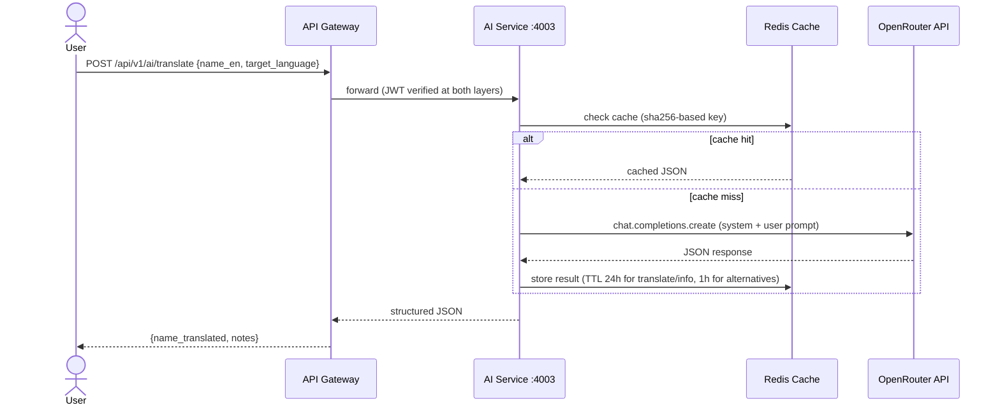
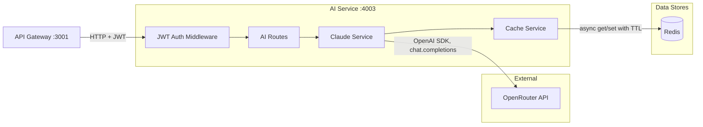
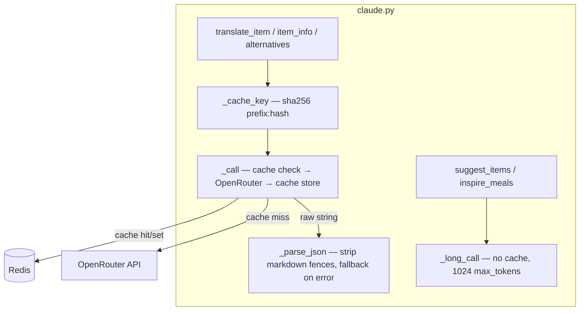

# AI Service — Codebase Introduction

## Part A: Business Logic Overview

The AI Service is a FastAPI microservice that enriches a grocery list application with LLM-powered intelligence. Users can translate grocery item names into other languages, get storage/nutrition info about items, and find alternative products. All AI calls are routed through OpenRouter (not a direct Anthropic/OpenAI API), and responses are cached in Redis to avoid redundant LLM calls.

### User-Facing Flows



The service handles three synchronous inference endpoints — translate, item-info, and alternatives — all following the same cache-then-LLM pattern. A fourth endpoint polls async job results from Redis by job ID.

### Feature List

| ID | Feature | Endpoint |
|----|---------|----------|
| FR-1-01-translate | Translate a grocery item name to a target language | `POST /api/v1/ai/translate` |
| FR-1-02-item-info | Get category, unit, storage tip, and nutrition note for an item | `POST /api/v1/ai/item-info` |
| FR-1-03-alternatives | Suggest substitute products, optionally filtered by reason (e.g. "dairy free") | `POST /api/v1/ai/alternatives` |
| FR-1-04-job-poll | Poll the status/result of an async AI job by ID | `GET /api/v1/ai/jobs/{job_id}` |
| FR-1-05-health | Health check (no auth) | `GET /health` |

---

## Part B: System Architecture



**Components:**

| Component | Role | Stack |
|-----------|------|-------|
| **AI Routes** | Request validation, endpoint handlers | FastAPI 0.115, Pydantic v2 |
| **JWT Auth Middleware** | Extracts and validates Bearer token (defense-in-depth — Gateway also verifies) | python-jose (HS256) |
| **Claude Service** | Builds prompts, calls OpenRouter, parses JSON responses, manages cache keys | openai SDK (AsyncOpenAI) pointed at OpenRouter base URL |
| **Cache Service** | Async Redis wrapper — lazy singleton, get/set with TTL, shutdown cleanup | redis-py async (aioredis) |
| **Redis** | Stores cached LLM responses (keyed by sha256 hash of inputs) and async job results | Redis 5+ |
| **OpenRouter** | LLM gateway — currently routing to `qwen/qwen3-235b-a22b-2507` | External API |

---

## Module Detail

### 1. Auth Middleware

The auth layer is a single FastAPI dependency at `app/middleware/auth.py`. Every AI endpoint declares `Depends(verify_token)`, which extracts the `sub` (user ID) from the JWT or returns 401.

```
# app/middleware/auth.py
# JWT verification as a FastAPI Security dependency.

# ── Token verification ────────────────────────────────────
verify_token(credentials: HTTPAuthorizationCredentials)
  → jwt.decode(token, settings.jwt_secret, algorithms=["HS256"])
  → payload.get("sub")  →  user_id: str
  #                         ↑ raises 401 if missing or JWTError
```

This is defense-in-depth: the API Gateway has already verified the token. The middleware re-verifies so the AI service never trusts a proxy blindly.

---

### 2. AI Routes

`app/routes/ai.py` defines all endpoints under the `/api/v1/ai` prefix.

**Request Models (Pydantic):**

| Model | Fields |
|-------|--------|
| `TranslateRequest` | `name_en: str`, `target_language: str` |
| `ItemInfoRequest` | `name_en: str` |
| `AlternativesRequest` | `name_en: str`, `reason: str = ""` |

```
# app/routes/ai.py
# Endpoint handlers — thin delegation to claude service.

# ── POST /translate ───────────────────────────────────────
translate(req: TranslateRequest)
  → claude.translate_item(req.name_en, req.target_language)
  → dict

# ── POST /item-info ──────────────────────────────────────
item_info(req: ItemInfoRequest)
  → claude.item_info(req.name_en)
  → dict

# ── POST /alternatives ───────────────────────────────────
alternatives(req: AlternativesRequest)
  → claude.alternatives(req.name_en, req.reason)
  → dict

# ── GET /jobs/{job_id} ───────────────────────────────────
get_job(job_id: str)
  → cache.cache_get(f"ai:result:{job_id}")
  → if None: {"status": "pending"}
  → if valid JSON: {"status": "done", "result": parsed}
  → else: {"status": "done", "result": raw_string}
```

The route layer is intentionally thin — no business logic. It validates input via Pydantic, delegates to services, and returns the result.

---

### 3. Claude Service (LLM Integration)

`app/services/claude.py` is the core — it handles prompt construction, OpenRouter calls, caching, and JSON parsing.



#### Sync Functions (used by current endpoints)

```
# app/services/claude.py
# LLM integration with two-tier caching.

# ── Cache key generation ─────────────────────────────────
_cache_key(prefix: str, data: str)  →  f"ai:{prefix}:{sha256(data)[:16]}"

# ── Core LLM call with cache ────────────────────────────
_call(prompt, system, cache_key, ttl=3600)
  → cache_get(cache_key)
  → if hit: return cached string
  → client.chat.completions.create(model, max_tokens=512, messages=[system, user])
  → cache_set(cache_key, result, ttl)
  → return raw string

# ── JSON parser ──────────────────────────────────────────
_parse_json(raw: str, fallback: dict)
  → strip markdown ```json...``` fences if present
  → json.loads(text)  →  dict
  #                       ↑ returns fallback on JSONDecodeError

# ── translate_item ───────────────────────────────────────
translate_item(name_en, target_language)
  → _call(prompt, system="grocery item translator", ttl=86400)
  → _parse_json(raw, fallback={"name_translated": name_en, "notes": ""})
  #                   ↑ fallback echoes original name on LLM failure

# ── item_info ────────────────────────────────────────────
item_info(name_en)
  → _call(prompt, system="grocery expert", ttl=86400)
  → _parse_json(raw, fallback={"category":"", "typical_unit":"", ...})

# ── alternatives ─────────────────────────────────────────
alternatives(name_en, reason="")
  → appends "Reason: {reason}" to prompt if provided
  → _call(prompt, system="grocery expert", ttl=3600)
  → _parse_json(raw, fallback={"alternatives": []})
```

**TTL strategy:** Translations and item info are stable facts — cached 24 hours. Alternatives depend on more context — cached 1 hour.

**Fallback strategy:** Every function has a typed fallback dict. If the LLM returns garbage or a markdown-fenced response that can't be parsed, the user still gets a well-shaped response (translate echoes back the original English name).

#### Async Worker Helpers (defined but not wired to endpoints)

Two functions exist for future async job processing. They use `_long_call` (no caching, 1024 max_tokens):

| Function | Input | Output Schema |
|----------|-------|---------------|
| `suggest_items(sections)` | Grocery list as dict | `{"suggestions": [{"name_en", "category", "reason"}]}` |
| `inspire_meals(sections, preferences)` | Grocery list + dietary prefs | `{"meals": [{"name", "description", "ingredients_used", "missing_ingredients"}]}` |

These are called nowhere in the current route layer — they exist as service-level functions only.

---

### 4. Cache Service

`app/services/cache.py` is a thin async wrapper around redis-py.

```
# app/services/cache.py
# Lazy-initialized async Redis singleton.

# ── Initialization ───────────────────────────────────────
get_redis()
  → creates aioredis.Redis(host, port, password, decode_responses=True) on first call
  → returns singleton _client

# ── Operations ───────────────────────────────────────────
cache_get(key)   → redis.get(key)  →  str | None
cache_set(key, value, ttl=3600)  → redis.set(key, value, ex=ttl)
close_redis()    → _client.aclose()  →  _client = None
#                  ↑ called in FastAPI lifespan shutdown
```

The `SGA_REDIS_PORT` env var (instead of `REDIS_PORT`) avoids collision with Kubernetes auto-injected `REDIS_PORT=tcp://...` service variables.

---

## Configuration

All settings are in `app/config.py` via Pydantic Settings, loaded from `../../.env`:

| Setting | Env Var | Default | Purpose |
|---------|---------|---------|---------|
| `openrouter_api_key` | `OPENROUTER_API_KEY` | `""` | OpenRouter auth |
| `openrouter_model` | `OPENROUTER_MODEL` | `qwen/qwen3-235b-a22b-2507` | LLM model ID |
| `jwt_secret` | `JWT_SECRET` | `change_me_in_production` | JWT signing key |
| `redis_host` | `REDIS_HOST` | `localhost` | Redis host |
| `redis_port` | `SGA_REDIS_PORT` | `6379` | Redis port (custom name to avoid k8s collision) |
| `redis_password` | `REDIS_PASSWORD` | `redis_secret` | Redis auth |

---

## API Reference

| Method | Path | Auth | Request Body | Response |
|--------|------|------|-------------|----------|
| GET | `/health` | None | — | `{"status": "ok", "service": "ai-service"}` |
| POST | `/api/v1/ai/translate` | JWT | `{"name_en": "Chicken Breast", "target_language": "Chinese"}` | `{"name_translated": "鸡胸肉", "notes": "..."}` |
| POST | `/api/v1/ai/item-info` | JWT | `{"name_en": "Milk"}` | `{"category": "Dairy", "typical_unit": "liter", "storage_tip": "...", "nutrition_note": "..."}` |
| POST | `/api/v1/ai/alternatives` | JWT | `{"name_en": "Milk", "reason": "dairy free"}` | `{"alternatives": [{"name": "Oat Milk", "reason": "dairy-free"}]}` |
| GET | `/api/v1/ai/jobs/{job_id}` | JWT | — | `{"job_id": "...", "status": "pending\|done", "result": ...}` |

---

## Test Suite

Tests use pytest + pytest-asyncio + httpx, with all external I/O mocked.

**Fixtures** (`tests/conftest.py`):
- `client` — session-scoped FastAPI `TestClient` with Redis shutdown mocked
- `auth_headers` — valid JWT Bearer header (user: `user-test-123`, secret: `test-secret`)
- `bad_auth_headers` — invalid Bearer token for 401 tests

**Route Tests** (`tests/test_routes_ai.py`):

| Test Class | Cases |
|------------|-------|
| `TestTranslate` | success, missing field (422), unauthenticated (403), invalid token (401) |
| `TestItemInfo` | success, missing name (422), unauthenticated (403) |
| `TestAlternatives` | success, no reason field provided |
| `TestGetJob` | pending (None), done with JSON, done with plain string, unauthenticated |

**Service Tests** (`tests/test_services_claude.py`):

| Test | What it validates |
|------|-------------------|
| `test_translate_fallback_on_invalid_json` | LLM returns garbage → fallback dict with original name |
| `test_item_info_fallback_on_invalid_json` | LLM returns garbage → fallback dict with empty strings |
| `test_alternatives_fallback_on_invalid_json` | LLM returns garbage → fallback with empty list |
| `test_translate_uses_cache_hit` | Cache hit → `get_client` never called |
| `test_parse_json_strips_markdown_fence` | ` ```json...``` ` fences are stripped before parsing |

**Cache Tests** (`tests/test_services_cache.py`):

| Test | What it validates |
|------|-------------------|
| `test_cache_set_stores_with_ttl` | `redis.set` called with correct key, value, and `ex=ttl` |
| `test_cache_get_returns_value` | Returns cached string |
| `test_cache_get_returns_none_for_missing` | Returns `None` for missing keys |

---

## Project Structure

```
services/ai-service/
├── app/
│   ├── __init__.py
│   ├── main.py                  # FastAPI app, CORS, lifespan, router includes
│   ├── config.py                # Pydantic Settings (env-based config)
│   ├── middleware/
│   │   └── auth.py              # JWT verification (HTTPBearer + HS256)
│   ├── routes/
│   │   ├── health.py            # GET /health
│   │   └── ai.py                # POST translate/item-info/alternatives, GET jobs/{id}
│   └── services/
│       ├── cache.py             # Async Redis wrapper (get/set/close)
│       └── claude.py            # OpenRouter LLM calls, caching, JSON parsing
├── tests/
│   ├── conftest.py              # Shared fixtures (TestClient, JWT helpers)
│   ├── test_routes_ai.py        # Endpoint integration tests
│   ├── test_services_claude.py  # LLM service unit tests (fallback, cache, parsing)
│   └── test_services_cache.py   # Cache service unit tests
├── pyproject.toml               # Dependencies (uv), ruff config
└── Dockerfile                   # Multi-stage build (uv builder → python:3.12-slim)
```

---

## Deployment

The Dockerfile uses a two-stage build:

1. **Builder stage** (`uv:python3.12-bookworm-slim`) — installs production deps only (`uv sync --frozen --no-dev`)
2. **Runtime stage** (`python:3.12-slim`) — copies app code + `.venv` from builder, exposes port 4003

```bash
# Local development
uv sync
uv run uvicorn app.main:app --reload --port 4003

# Container
docker build -t ai-service .
docker run -p 4003:4003 --env-file ../../.env ai-service
```
