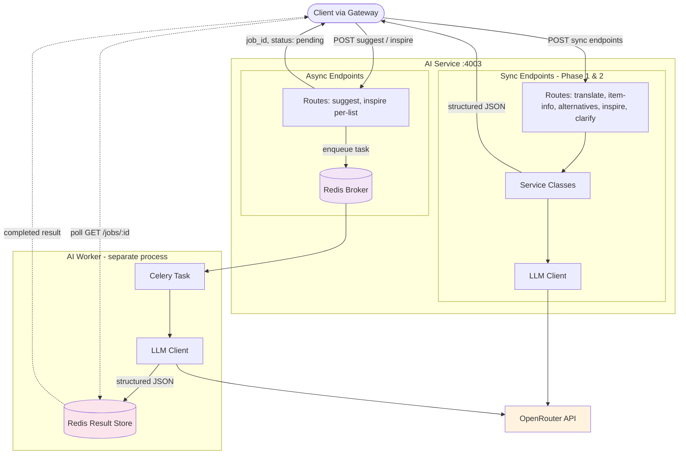
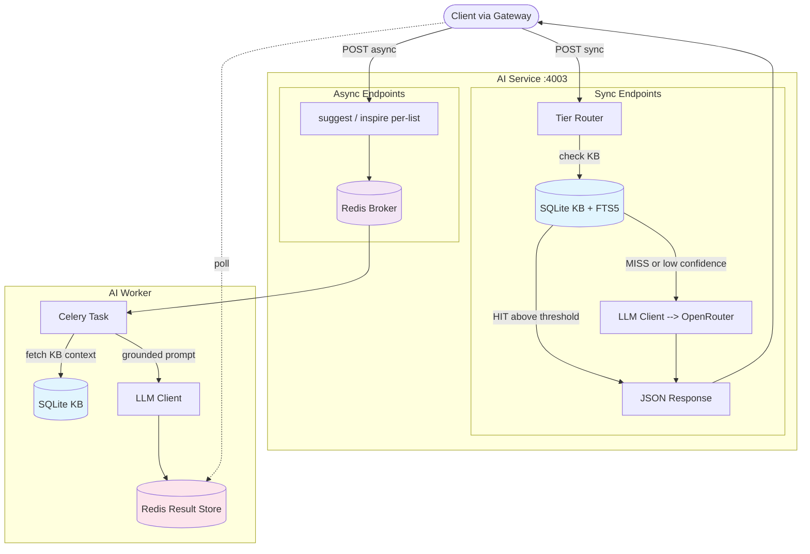
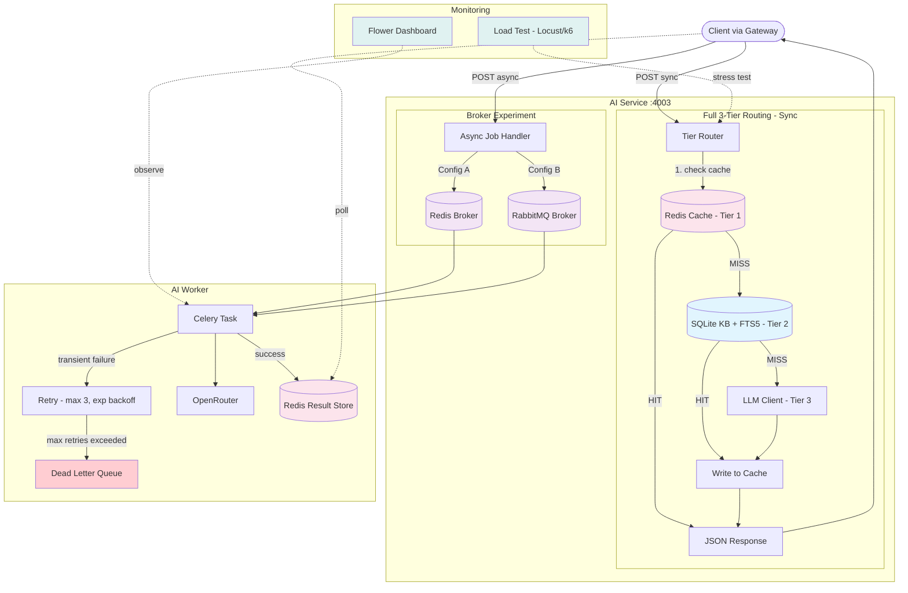

# AI Service -- Phased Implementation Plan

**Last updated:** 2026-03-28
**Owner:** Dako (@iDako7)
**Status:** Rewrite from scratch. LLM-first approach with TDD methodology.

**Approach:** Hybrid code style -- classes for stateful things (LLM client, services with dependencies), functions for pure logic (routes, prompt builders, parsers), Pydantic models for data shapes.

**Sequence:** Start with LLM-only (no cache, no KB), prove each endpoint works end-to-end, then layer in KB and cache.

---

## Phase 1: Foundation + First Sync Endpoints

**Goal:** AI service skeleton is running. Two simplest endpoints work end-to-end with LLM.

**Endpoints:** `POST /translate`, `POST /item-info`, `GET /health`

**Scope:**
- FastAPI project skeleton with config (Pydantic Settings)
- LLM client class (wraps OpenRouter via `openai` SDK, handles retries, structured JSON output)
- Service layer classes (TranslateService, ItemInfoService) that hold LLM client reference
- JWT auth middleware (local verification with shared secret, no dependency on User Service)
- Prompt engineering: test prompts via raw API calls first, then integrate
- Structured JSON output from LLM for uniform interface
- Request/response Pydantic models matching prototype schemas

**Not in scope:** cache, KB, async, Celery

**Architecture:**
```
Route (function) --> Service (class) --> LLM Client (class) --> OpenRouter API
                                                                     |
POST /translate  --> TranslateService  --> llm_client.chat()   --> structured JSON
POST /item-info  --> ItemInfoService   --> llm_client.chat()   --> structured JSON
```

**TDD workflow:** Write endpoint tests (mock LLM client) --> implement service --> implement route --> pass tests. Separately: integration tests with real LLM calls (marked slow, skipped in CI).

**Open questions to resolve:** OQ-1 (LLM model selection -- resolve by testing prompts against candidate models)

**Exit criteria:**
- `/translate` returns `{name_en, name_zh}` with bidirectional detection
- `/item-info` returns `{taste, usage, picking, storage, funFact}`
- All responses are structured JSON from LLM
- JWT auth enforced on all endpoints
- Tests passing with coverage target

---

## Phase 2: Remaining Sync Endpoints

**Goal:** All sync AI features from the prototype are working.

**Endpoints:** `POST /alternatives`, `POST /inspire` (per-item), `POST /clarify`

**Scope:**
- AlternativesService, InspireService, ClarifyService -- same OOP pattern as Phase 1
- Prompt engineering for complex outputs:
  - Alternatives: match levels (Very close / Similar / Different but works), aisle hints
  - Per-item inspire: 3 recipes with missing ingredients and "Add All" support
  - Clarify: 1-3 adaptive questions with tappable chip options, `allowOther` flag
- User profile context (dietary restrictions, household size, language) fed into all prompts

**Not in scope:** cache, KB, async

**TDD workflow:** Same as Phase 1. By now the OOP pattern is familiar.

**Exit criteria:**
- `/alternatives` returns `{note, alts: [{name_en, name_zh, match, desc, where}]}`
- `/inspire` (per-item) returns `{recipes: [{name, name_zh, emoji, desc, add}]}`
- `/clarify` returns `{questions: [{q, options, allowOther}]}` with 1-3 adaptive questions
- All 5 sync endpoints working with LLM, user profile context included

---

## Phase 3: Async Pipeline (Suggest + Per-List Inspire)

**Goal:** The two heavy AI features work as async jobs. The two-step suggest flow (clarify --> suggest) is wired end-to-end.

**Endpoints:** `POST /suggest`, `POST /inspire` (per-list), `GET /jobs/:id`

**Scope:**
- Celery app with Redis as broker
- Celery worker process (separate from FastAPI)
- Async job lifecycle: submit --> enqueue --> worker processes --> result in Redis --> client polls
- Two-step suggest flow: client calls `/clarify` (sync, Phase 2) --> submits answers to `/suggest` (async) with user context
- Suggest response schema: `{reason, clusters, ungrouped, storeLayout}` -- powers both Smart View and List View
- Per-list inspire: async job returning 3 meal ideas with missing ingredients from full grocery list
- Result storage: `ai:result:{job_id}` in Redis with TTL 3600s
- Client polls `GET /jobs/:id` every 2s
- Retry logic (Celery built-in, max 3 retries with exponential backoff)

**Architecture:**



**TDD workflow:** Test job submission (returns job_id), test polling (pending --> completed), test worker task logic (mock LLM, verify output schema). Integration test: full async round-trip.

**Exit criteria:**
- Submit grocery list --> get `{reason, clusters, ungrouped, storeLayout}` via polling
- Per-list inspire returns 3 meal ideas with missing ingredients
- Jobs complete within 15s
- Retry on transient LLM failures
- Two-step flow: clarify answers feed into suggest as user context

---

## Phase 4: Knowledge Base + Tier Routing

**Goal:** Common queries are served from KB without hitting LLM. The AI service is cheaper and faster for known data.

**Scope:**
- SQLite KB schema: products (with `component_role`), recipes (with `flavor_profile`), recipe_ingredients, substitutions, `flavor_tags` junction table
- FTS5 full-text search index on products
- KB seed data: ~50 Costco products (from `data/costco_raw/`), 2-3 cuisines, 10 recipes per cuisine
- Seed scripts: offline population via script + LLM generation + human review
- Tier routing: KB --> LLM fallback (2-tier for now, cache added in Phase 5)
- Explicit request-type routing as backbone (translate/item-info/alternatives check KB first; suggest/inspire always go to LLM)
- Confidence-based scoring inside KB tier for FTS5 fuzzy search
- KB context injection into LLM prompts (LLM reasons over KB data when KB has partial match)

**RAG note:** Design the retrieval interface (KB query layer) to be pluggable -- backed by SQLite FTS5 now, could be swapped for a vector store later without changing the service layer.

**Architecture:**



**Open questions to resolve:** OQ-3 (cuisines and recipes), OQ-4 (FTS5 confidence threshold)

**TDD workflow:** Test KB queries (exact match, fuzzy match, miss), test tier routing decisions, test fallback to LLM, test KB context injection into prompts.

**Exit criteria:**
- Translate/item-info/alternatives served from KB when data exists (fast, free)
- FTS5 returns ranked results for fuzzy queries
- LLM fallback works for unknown queries
- KB context injected into LLM prompts for grounded suggestions
- Retrieval interface is pluggable (abstracted behind a class/protocol)

---

## Phase 5: Cache + Optimization + RabbitMQ Experiment

**Goal:** Full 3-tier routing is wired. The system is production-hardened with load test data.

**Scope:**
- Redis response cache as Tier 1 (in front of KB and LLM)
- Full tier routing: Cache --> KB --> LLM
- Cache key strategy: includes request type + query + user preferences (dietary, household_size, language)
- Per-request-type TTL (starting values from OQ-5)
- Cache population: KB/LLM responses written to cache on serve
- Don't cache inspire results (users expect variety)
- Cache hit rate logging/metrics
- Swap Celery broker to RabbitMQ, benchmark both under load
- Load testing with Locust or k6: throughput, latency, backpressure, failure recovery
- Dead letter queue handling (RabbitMQ native)
- Monitoring: Flower dashboard for Celery task visibility
- Document broker comparison results, pick winner with data

**Architecture:**



**Open questions to resolve:** OQ-5 (cache TTL values), OQ-6 (AWS ECS Fargate -- if deploying after this phase)

**TDD workflow:** Test cache hit/miss, test TTL expiry, test full 3-tier routing, load test async pipeline.

**Exit criteria:**
- First request goes through KB/LLM, second identical request served from cache
- Cache hit rate measurable (target: 70%+ of requests served without LLM)
- Load test report comparing Redis vs RabbitMQ brokers under 50 concurrent requests
- Broker decision finalized with data justification
- Error scenarios tested (worker crash, queue full, LLM timeout)

---

## Future Considerations

- **RAG:** Vector embeddings (text-embedding-3-small) + semantic search (pgvector or ChromaDB) when KB grows beyond FTS5 capability (200-500+ products). The pluggable retrieval interface from Phase 4 enables swapping in a vector store without changing the service layer.
- **`/restock` endpoint (OQ-7):** Routine grocery shopping using PCSV framework (Protein, Carb, Sauce, Vegetable) + flavor profiles. KB schema from Phase 4 includes `component_role` and `flavor_tags` to support this. Requires inventory tracking and gap detection (product features, not AI service scope).
- **KB expansion:** More cuisines, more products, multilingual names (name_zh, name_ko, name_es via LLM translation or manual curation), aisle hints (requires in-store data).
