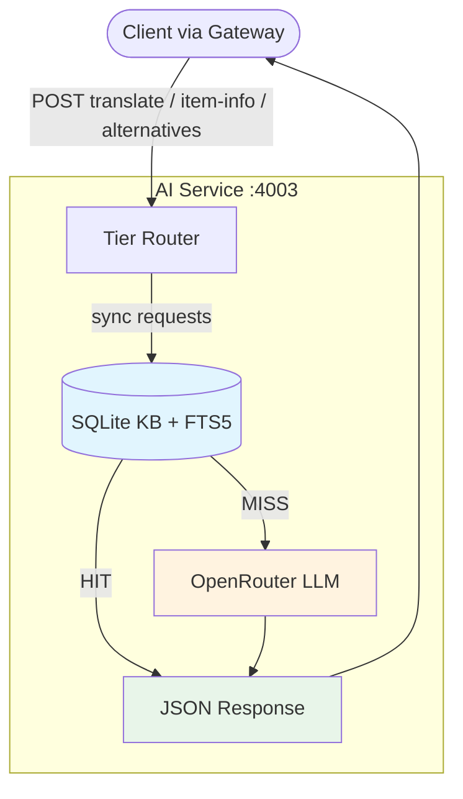
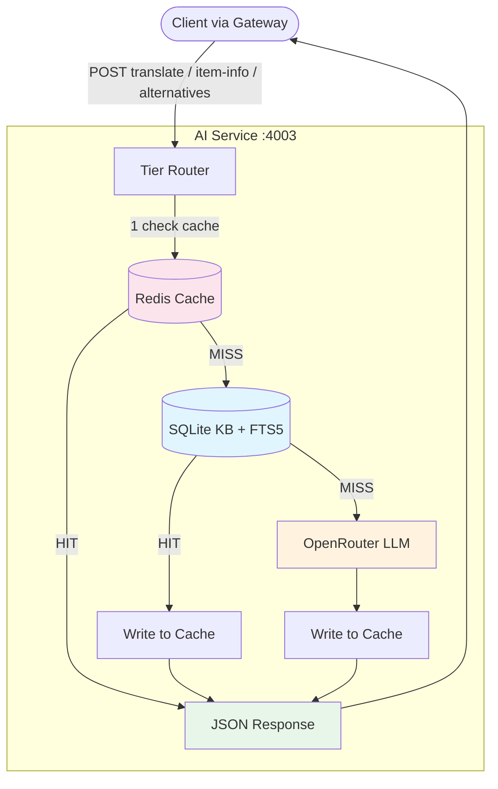
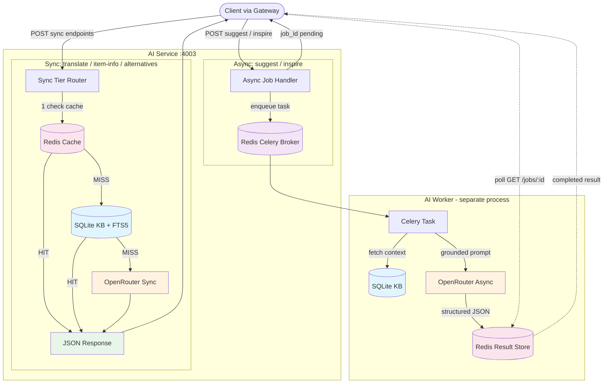
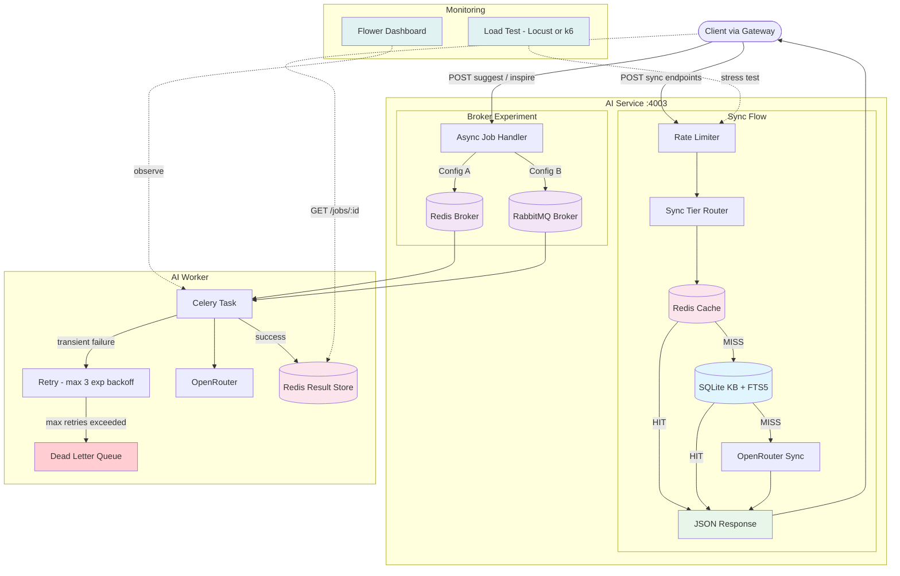

# AI Service -- Phased Implementation Plan

**Last updated:** 2026-03-28
**Owner:** Person C
**Status:** Pre-implementation. Architecture decisions finalized, ready to begin Phase 1.

---

## Phase 1: Knowledge Base + Sync AI Features

**User story:** User asks "what aisle is chicken in?" and gets an answer from the KB in <100ms. If KB doesn't know, LLM answers in 3-5s.

**Goal:** AI service is running with KB-powered responses and LLM fallback for sync features.

**Open questions to resolve:** OQ-1 (LLM model selection), ~~OQ-2 (Costco data sourcing)~~, OQ-3 (cuisines and recipes), OQ-4 (FTS5 confidence threshold -- resolve during build)
**Resolved:** OQ-2 — 396 unique products scraped from Costco Sameday across 7 departments, stored in `services/ai-service/data/costco_raw/`

**Stack:** FastAPI, SQLite + FTS5, OpenRouter, JWT auth middleware

**Deliverables:**
- FastAPI project structure with health check endpoint
- SQLite KB schema: products (with component_role), recipes (with flavor_profile), recipe_ingredients, substitutions, flavor_tags tables
- FTS5 full-text search index on products
- KB seed data: ~50 Costco products, 2-3 cuisines, 10 recipes per cuisine
- Tier 2 (KB) with structured queries + FTS5 fuzzy search
- Sync endpoints: `POST /translate`, `POST /item-info`, `POST /alternatives`
- Tier 3 (LLM) sync fallback via OpenRouter
- Hybrid tier routing: explicit request-type routing + confidence scoring in KB tier
- Structured JSON output from LLM (uniform interface across tiers)
- JWT auth middleware (verify tokens issued by User Service)
- Unit + integration tests

**What you learn:** FastAPI project patterns, SQLite FTS5 full-text search, OpenRouter API integration, structured output prompting, tier routing design

**Architecture:**

**Exit criteria:**
- All 3 sync endpoints return correct responses from KB (fast path) and LLM (fallback)
- FTS5 returns ranked results for fuzzy queries like "find meat"
- Tests passing with coverage target
- Other services (Gateway, List Service) can integrate against these endpoints

---

## Phase 2: Redis Caching Layer

**User story:** User asks the same question twice -- second time is instant from cache.

**Goal:** Repeated queries are instant and free. Cache hit rate is measurable toward the 70% target.

**Open questions to resolve:** OQ-5 (cache TTL values)

**Stack adds:** Redis

**Deliverables:**
- Redis connection and cache module
- Tier 1 (Cache) in front of KB and LLM
- Cache key strategy: includes request type + query + user preferences (dietary, household_size, language)
- TTL strategy per request type (values TBD -- see open questions)
- Cache population: Tier 2/3 responses written to cache on serve
- Full tier routing wired: Cache -> KB -> LLM
- Cache hit rate logging/metrics
- Don't cache `inspire` results (users expect variety)

**What you learn:** Redis integration patterns, cache key design, TTL tuning, measuring cache effectiveness

**Architecture:**

**Exit criteria:**
- First request goes through KB/LLM, second identical request served from cache
- Cache hit rate measurable (even if not yet 70%)
- No regression in sync endpoint response quality

---

## Phase 3: Async Pipeline (Suggest / Inspire)

**User story:** User submits their grocery list and gets back "you're missing X, Y, Z for the Korean BBQ you're planning" -- grounded in real Costco products, not hallucinated.

**Goal:** Suggest and Inspire work end-to-end as async jobs. This is where the "smarter than ChatGPT" value proposition becomes real.

**Open questions to resolve:** None -- all prerequisites resolved in earlier phases.

**Stack adds:** Celery + Redis broker

**Deliverables:**
- Celery app configuration with Redis as broker
- Celery worker process (separate from FastAPI)
- Async endpoints: `POST /suggest`, `POST /inspire`
- Job submission: returns `{job_id, status: "pending"}`
- Worker: fetches KB context, builds grounded prompt, calls OpenRouter, parses structured JSON
- Result storage in Redis: `ai:result:{job_id}` with TTL
- Client polling endpoint: `GET /jobs/:id`
- KB context injection into LLM prompts (LLM reasons over KB data, not from scratch)
- Retry logic (Celery built-in, max 3 retries with exponential backoff)
- Prompt engineering for suggest (gap analysis) and inspire (meal ideas)

**What you learn:** Celery task patterns, async job lifecycle, prompt engineering with KB grounding, structured output parsing, polling patterns

**Architecture:**

**Exit criteria:**
- Submit a grocery list, get back personalized suggestions grounded in Costco products
- Submit again, get different meal inspiration
- Jobs complete within 15s, retry on transient failures
- Cache populated after async completion (next identical request hits Tier 1)

---

## Phase 4: Hardening + RabbitMQ Experiment

**User story:** System handles 50 users hitting suggest/inspire at the same time without falling over. You have the data to prove it.

**Goal:** Production-ready with load test data comparing Redis vs RabbitMQ as Celery broker.

**Open questions to resolve:** OQ-6 (AWS ECS Fargate configuration -- if deploying after this phase)

**Stack adds:** RabbitMQ (as alternative Celery broker)

**Deliverables:**
- Swap Celery broker to RabbitMQ (`amqp://` instead of `redis://`)
- Load testing with Locust or k6: both broker configurations
- Benchmark: throughput, latency, backpressure behavior, failure recovery
- Dead letter queue handling (RabbitMQ native)
- Monitoring: Flower dashboard for Celery task visibility
- Error recovery: worker crash mid-job, queue backlog, timeout handling
- Rate limiting at AI service level
- Document broker comparison results with data
- Pick winner based on evidence

**What you learn:** Message broker trade-offs with real data, load testing methodology, production hardening, monitoring patterns

**Architecture:**

**Exit criteria:**
- Load test report comparing both brokers under 50 concurrent requests
- Broker decision finalized with data justification
- Error scenarios tested (worker crash, queue full, LLM timeout)
- Monitoring dashboard operational

---

## Future: RAG + KB Expansion (Out of MVP Scope)

**Goal:** Scale knowledge base with semantic search for complex queries.

**Stack adds:** Embeddings model (text-embedding-3-small), pgvector or ChromaDB

**Deliverables:**
- Expand KB to 200-500+ products
- Embedding generation pipeline for products and recipes
- Vector similarity search for semantic queries
- Hybrid search: FTS5 for exact/keyword, vector for semantic
- RAG retrieval integrated into Tier 2 as a smarter KB layer

**Why not now:** 50 products is too small for embeddings to add value over FTS5. RAG infrastructure (embedding pipeline, vector storage, retrieval tuning, chunk strategy) is significant overhead for marginal gain at MVP scale.

**Prerequisites:** Phase 4 complete, clear evidence that FTS5 is insufficient for user queries
