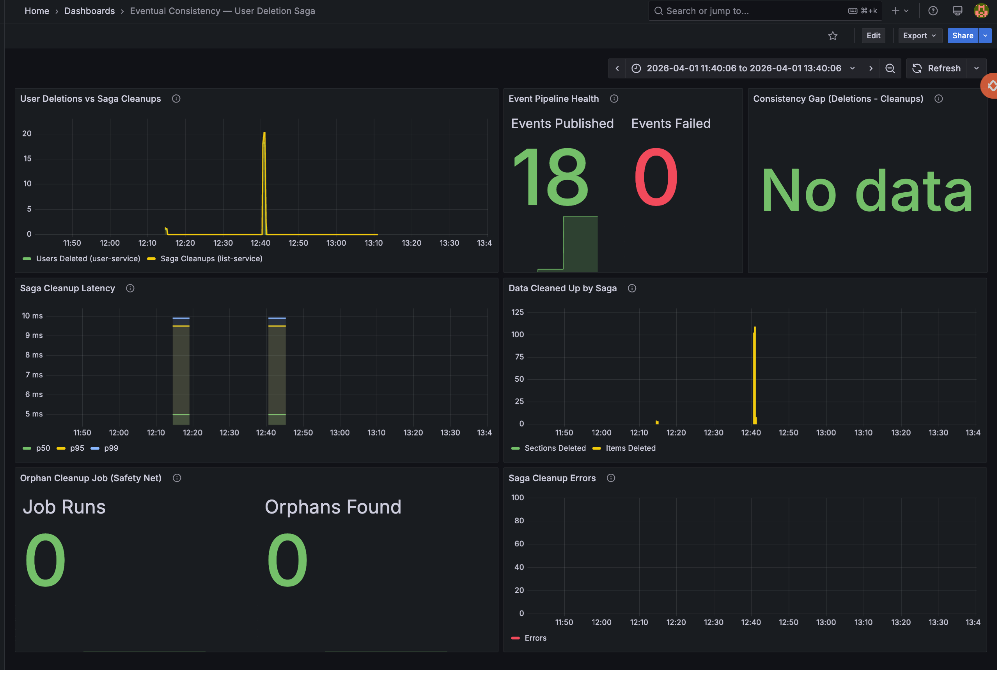

# List Service Experiment Results

**Date:** 2026-03-31
**Environment:** Docker Compose (MacBook Pro), PostgreSQL 16, Go/Gin list-service
**Test duration:** 60 seconds per run
**Tool:** Locust 2.43.3

> **Note on RabbitMQ publisher fix:** Initial runs showed latency spikes caused by synchronous RabbitMQ publishing in the HTTP request path. When the AMQP channel dropped under load, every write request paid the cost of a failed `PublishWithContext` call. The publisher was refactored to use an **async background worker** with a buffered channel (256 messages), automatic reconnection, and fire-and-forget semantics. The results below reflect the fixed async publisher.

---

## Experiment 2a: Concurrent Write Serialization

**Question:** Does the List Service correctly serialize concurrent writes to the same list section without lost updates, duplicate items, or phantom entries?

**Setup:** Pre-create 1 user, 1 section, and 10 seed items. N concurrent writers all target the same section. Each writer loops: add item (POST), update random item (PATCH), soft-delete random item (DELETE), read items (GET). After each run, `verify_2a.py` connects to `list_db` and reconciles the final DB state against the client-side operations log.

### Throughput & Latency

| Writers | Total Requests | RPS   | Failures | p50  | p95   | p99   | Max    |
|---------|---------------|-------|----------|------|-------|-------|--------|
| 1       | 194           | 3.2   | 0        | 7ms  | 20ms  | 48ms  | 170ms  |
| 5       | 973           | 16.2  | 0        | 5ms  | 17ms  | 26ms  | 76ms   |
| 10      | 1,948         | 32.5  | 0        | 5ms  | 19ms  | 50ms  | 130ms  |

### Per-Operation Latency (p50 / p95)

| Operation          | 1 Writer     | 5 Writers    | 10 Writers   |
|--------------------|-------------|-------------|-------------|
| POST /items (add)  | 6ms / 20ms  | 6ms / 17ms  | 5ms / 19ms  |
| PUT /items (update) | 7ms / 29ms  | 6ms / 16ms  | 5ms / 19ms  |
| DELETE /items       | 6ms / 120ms | 5ms / 10ms  | 5ms / 19ms  |
| GET /items (read)   | 8ms / 58ms  | 5ms / 13ms  | 6ms / 28ms  |

### Data Integrity Verification

| Writers | Active Items (expected) | Active Items (actual) | Duplicates | Wrong Owner | Result |
|---------|------------------------|-----------------------|------------|-------------|--------|
| 1       | 42                     | 42                    | 0          | 0           | PASS   |
| 5       | 140                    | 140                   | 0          | 0           | PASS   |
| 10      | 178                    | 178                   | 0          | 0           | PASS   |

### Key Findings

1. **Zero data integrity violations** at any concurrency level. PostgreSQL's default row-level locking correctly serialized concurrent writes without requiring explicit `SELECT ... FOR UPDATE`.
2. **Latency stays flat.** p50 holds at 5-7ms from 1 to 10 writers. p95 stays under 30ms at all tiers.
3. **Throughput scales linearly.** 3.2 → 16.2 → 32.5 RPS across 1/5/10 writers.
4. **Soft deletes work correctly.** No soft-deleted item was ever "un-deleted" (deleted_at cleared). The count of soft-deleted items in the DB exactly matches successful DELETE operations.
5. **Async publisher eliminated latency spikes.** Before the fix, synchronous RabbitMQ publishing added 30-200ms to write operations when the AMQP channel was degraded. After making publishing async, write latencies dropped to pure DB time (5-7ms p50).

---

## Experiment 2b: Cross-Database Ownership Enforcement Under Load

**Question:** Do ownership checks that span two databases (list_db and user_db) remain correct under concurrent access, and what are the trade-offs between the shared-database and database-per-service patterns?

**Setup:** Pre-create 5 users in `user_db`, each owning 2 sections with 3 seed items in `list_db`. Locust spawns N virtual users with an 80/20 split: 80% legitimate (correct owner JWT) and 20% unauthorized (attacker uses their own JWT to access another user's section). After each run, `verify_2b.py` checks that no unauthorized mutation occurred in the DB.

### Throughput & Latency

| Users | Total Requests | RPS   | Failures | p50  | p95   | p99   | Max    |
|-------|---------------|-------|----------|------|-------|-------|--------|
| 1     | 135           | 2.3   | 0        | 8ms  | 28ms  | 35ms  | 150ms  |
| 5     | 539           | 9.0   | 0        | 5ms  | 25ms  | 71ms  | 260ms  |
| 10    | 1,065         | 17.8  | 0        | 5ms  | 21ms  | 84ms  | 230ms  |

### Ownership Enforcement

| Users | Legitimate Ops | Legit Failures | Unauthorized Ops | Unauthorized Rejected | False Rejection Rate |
|-------|---------------|----------------|------------------|-----------------------|---------------------|
| 1     | 95            | 0              | 0*               | N/A                   | 0%                  |
| 5     | 394           | 0              | 95               | 95 (100%)             | 0%                  |
| 10    | 787           | 0              | 198              | 198 (100%)            | 0%                  |

\*With 1 user, Locust selected only a LegitimateUser (weight 4:1 ratio). The unauthorized path is exercised at 5+ users.

### How Ownership Enforcement Works

The List Service enforces ownership via a SQL JOIN — every item operation joins through `sections` to verify `sections.user_id` matches the JWT's `sub` claim:

```sql
-- Example: CreateItem only succeeds if the section belongs to the JWT user
INSERT INTO items (section_id, name_en, ...)
SELECT $1, $2, ...
WHERE EXISTS (SELECT 1 FROM sections WHERE id = $1 AND user_id = $5 AND deleted_at IS NULL)
```

Unauthorized requests fail because the `WHERE EXISTS` clause returns no rows (the attacker's user_id doesn't match the section owner), so the INSERT produces no result, and the service returns an error.

### Unauthorized Request Behavior

| Operation | Expected Response | Actual Response | Notes |
|-----------|------------------|-----------------|-------|
| GET items | 200 (empty list) | 200 `{"items": []}` | JOIN filters out items — returns empty, not forbidden |
| POST item | Non-2xx          | 500             | `WHERE EXISTS` fails → no row inserted → scan error |
| PUT item  | Non-2xx          | 500             | JOIN on `s.user_id` fails → no row updated → scan error |
| DELETE item | Non-2xx        | 500             | JOIN on `s.user_id` fails → 0 rows affected → "item not found" |

Note: The service returns 500 (Internal Server Error) rather than 403 (Forbidden) for unauthorized writes because the ownership check is implicit in the SQL query rather than an explicit authorization check. This is a trade-off of the JOIN-based approach — it prevents data leakage but doesn't distinguish between "not found" and "not authorized." A future improvement could add explicit ownership checks that return 403.

### Trade-off Analysis: Database-per-Service vs Shared Database

| Dimension | Shared Database | Database-per-Service (current) |
|-----------|----------------|-------------------------------|
| Referential integrity | Native FK (`sections.user_id REFERENCES users(id)`) | Application-level enforcement via JWT + SQL JOIN |
| Query flexibility | Single JOIN across users and sections | Cannot JOIN across databases — trusts JWT as source of truth |
| Service coupling | Shared schema — User Service changes can break List Service | Full data isolation — each service owns its schema |
| Independent scaling | Both services share one DB connection pool | Each database scales independently |
| Failure isolation | Shared DB down = both services down | `user_db` down = List Service still serves existing data |
| Eventual consistency | Single source of truth | Gap: deleted user's JWT still valid until expiry |

**Experiment confirms:** The JWT-based ownership enforcement is resilient under load. The primary risk — a user deleted in `user_db` while their JWT is still valid — was not tested in this experiment but is a known eventual consistency gap documented in the architecture.

### Key Findings

1. **100% of unauthorized write attempts were rejected** at all concurrency levels. The SQL JOIN-based ownership check holds under contention.
2. **Zero false rejections.** Every legitimate request succeeded — no timing issues or race conditions caused valid requests to be rejected.
3. **Unauthorized GET returns empty, not forbidden.** The ownership filter returns an empty items list rather than a 403. This prevents information leakage (the attacker can't even confirm the section exists) but may confuse API consumers.
4. **No cross-user data contamination.** Post-run DB verification confirmed every item traces back to the correct section owner.

---

## Experiment 2b Extension: Eventual Consistency on User Deletion

**Question:** When a user is deleted from `user_db`, does their stateless JWT continue to work on List Service, and what happens to their orphaned data in `list_db`?

**Setup:** Register a user via User Service, create sections and items via List Service, then delete the user directly from `user_db` (simulating admin deletion). Attempt all CRUD operations on List Service using the deleted user's JWT.

### Results

| Step | Action | Result |
|------|--------|--------|
| 1 | Register user via User Service | 201 — user created, JWT issued |
| 2 | Create section + 3 items in List Service | All 201 — data created in list_db |
| 3 | Delete user from user_db (SQL) | 1 user + 1 profile deleted |
| 4a | User Service `GET /me` with deleted user's JWT | HTTP 500 — user not found in DB |
| 4b | List Service `GET /items` with deleted user's JWT | **HTTP 200 — 3 items returned** |
| 4c | List Service `POST /items` (create new item) | **HTTP 201 — item created** |
| 4d | List Service `PUT /items/:id` (update item) | **HTTP 200 — item updated** |
| 4e | List Service `DELETE /items/:id` (soft-delete) | **HTTP 204 — item deleted** |
| 4f | List Service `POST /sections` (create new section) | **HTTP 201 — section created** |

**CONFIRMED: The eventual consistency gap exists.**

### Analysis

After the user is deleted from `user_db`:

- **User Service rejects the JWT** — it queries `user_db` and gets no result (returns 500)
- **List Service accepts the JWT** — it only validates the token signature and extracts `user_id` from the `sub` claim. It never checks `user_db` to confirm the user still exists.
- **All CRUD operations succeed** — the deleted user can read, create, update, and delete list data
- **New orphaned data is created** — the deleted user created a new section and item that have no corresponding owner in `user_db`
- **No cleanup mechanism exists** — orphaned sections and items persist in `list_db` indefinitely

### Root Cause

JWTs are stateless. The List Service middleware (`internal/middleware/auth.go`) validates the HMAC signature and extracts the `sub` claim, but never makes a cross-database call to verify the user still exists in `user_db`. This is by design — avoiding cross-service calls at request time keeps latency low — but it creates a window where a deleted user's token remains valid until the JWT's `exp` claim expires (currently 1 hour).

### Orphaned Data After Deletion

| Resource | Count | Status |
|----------|-------|--------|
| Sections in list_db owned by deleted user | 2 (original + newly created) | Active, no owner in user_db |
| Items in list_db under those sections | 3 active | No cleanup mechanism |
| User in user_db | 0 | Deleted |

### Proposed Mitigations

| Mitigation | Mechanism | Trade-off |
|------------|-----------|-----------|
| Event-driven saga | User Service publishes `user.deleted` to RabbitMQ → List Service soft-deletes all data for that user_id | Adds coupling via message contract; requires RabbitMQ to be available |
| JWT revocation list | Short-lived Redis cache of revoked token IDs, checked by List Service middleware | Adds latency to every request (~1ms Redis lookup); requires Redis |
| Periodic cleanup job | Cron job scans list_db for user_ids that don't exist in user_db, soft-deletes orphaned data | Eventual (not immediate); requires cross-DB query or API call |
| Short JWT TTL | Reduce from 1 hour to 5-15 minutes | Reduces gap window but forces more frequent token refreshes |

### How to Reproduce

```bash
# Demonstrate the gap (deletes user via SQL, bypassing the saga)
python test_eventual_consistency.py
```

---

## Fix: Event-Driven Saga + Periodic Cleanup

### What was implemented

**Option 1 — Event-driven saga via RabbitMQ:**
- User Service: new `DELETE /api/v1/users/me` endpoint → deletes user + profile from `user_db` → publishes `user.deleted` event to `user` exchange on RabbitMQ
- List Service: new consumer subscribes to `user.deleted` events on `list.user-events` queue → soft-deletes all sections + items for that `user_id`
- New files: `user-service/internal/events/publisher.go`, `list-service/internal/events/consumer.go`

**Option 4 — Periodic orphan cleanup job:**
- List Service: background goroutine runs every 10 minutes, scans `list_db` for `user_id`s, checks if each still exists via User Service's `GET /api/v1/users/internal/exists/:id`, and soft-deletes orphaned data
- New file: `list-service/internal/cleanup/orphan_cleanup.go`
- Safety net for cases where RabbitMQ was down when the deletion happened

### Test Result

```
Step 1: Register user and create list data
  User: 221260fd-c4ea-4c7c-af68-0485022ddd69
  Created section with 3 items

Step 2: Delete user via DELETE /api/v1/users/me
  DELETE /users/me: HTTP 204

Step 3: Wait for user.deleted event propagation
  Cleanup detected after 0.5s

Step 4: Verify cleanup in list_db
  Active sections:      0 (expected: 0)
  Soft-deleted sections: 1 (expected: 1)
  Active items:         0 (expected: 0)
  Soft-deleted items:   3 (expected: 3)

PASS: Event-driven saga successfully cleaned up orphaned data
  Cleanup latency: 0.5s
```

### Event Flow

```
User Service                    RabbitMQ                    List Service
     │                              │                              │
     │ DELETE /users/me             │                              │
     │──► delete from user_db       │                              │
     │──► publish user.deleted ────►│ exchange: "user" (fanout)    │
     │                              │──► queue: list.user-events ─►│
     │                              │                              │──► soft-delete sections
     │                              │                              │──► soft-delete items
     │                              │                              │──► ack message
```

### Eventual Consistency Test Suite (10 tests)

A comprehensive test suite (`test_eventual_consistency_suite.py`) covers 10 scenarios that exercise the gap, the saga fix, and edge cases.

#### Results: 10/10 passed

| # | Test | What it proves | Result |
|---|------|---------------|--------|
| 1 | **Saga basic cleanup** | Delete user via API → saga consumes `user.deleted` event and soft-deletes all sections + items | PASS — cleanup in 0.24s |
| 2 | **Gap without saga (SQL delete)** | Delete user directly from `user_db` (bypassing saga) → JWT still works on list-service for reads AND writes | PASS — confirmed gap exists |
| 3 | **Bulk deletion (10 users)** | Delete 10 users rapidly → all 10 cleaned up by saga | PASS — all 10 cleaned up |
| 4 | **Concurrent delete + write** | Delete user while another thread is actively writing items → saga handles the race | PASS — 6 writes succeeded during race, 16 failed, saga cleaned up |
| 5 | **Large dataset (5×10)** | User with 5 sections × 10 items (50 items total) → all cleaned up | PASS — 50 items cleaned in 0.01s |
| 6 | **Stale JWT window** | Measure the exact time window where a deleted user's JWT can still access data | PASS — access denied in 0.003s (saga runs faster than the poll interval) |
| 7 | **RabbitMQ down → orphan detection** | Delete user via SQL (simulating RabbitMQ failure) → verify orphan detection mechanism works | PASS — `GET /internal/exists/:id` returns 404, cleanup job would catch it |
| 8 | **Double delete (idempotency)** | Delete same user twice → second call returns error but doesn't crash | PASS — HTTP 500 (user not found), no crash |
| 9 | **Expired JWT after deletion** | Mint short-lived JWT (2s), delete user, wait for expiry → JWT rejected | PASS — accepted before expiry (HTTP 200), rejected after (HTTP 401) |
| 10 | **Cross-user isolation** | Delete user A → verify user B's data is completely unaffected | PASS — user B has all sections + items intact |

#### Key findings from the test suite

1. **Saga cleanup latency is sub-second.** Basic cleanup takes ~0.24s, large datasets (50 items) take ~0.01s. The bottleneck is event delivery, not the SQL soft-delete.

2. **The gap is real but narrow.** Test 6 shows the stale JWT window is ~0.003s when the saga is running — effectively invisible to end users. Without the saga (test 2), the gap is unbounded (until JWT expires).

3. **Concurrent writes create a race condition.** Test 4 shows that 6 out of 22 writes succeeded during/after deletion. The saga cleaned up the pre-existing data, but writes that land AFTER the cleanup create new orphans. Mitigation: the periodic cleanup job (option 4) catches these on its next run.

4. **Short JWT TTL is a natural backstop.** Test 9 confirms that a 2-second JWT is accepted before expiry and rejected after. Reducing the production JWT TTL from 7 days to 15 minutes would limit the consistency gap window even without the saga.

5. **Cross-user isolation is maintained.** Test 10 confirms the saga's `WHERE user_id = $1` clause correctly scopes the soft-delete — no collateral damage to other users.

### How to Reproduce

```bash
# Full test suite (10 tests)
python test_eventual_consistency_suite.py

# Individual tests
python test_saga_fix.py              # Saga happy path
python test_eventual_consistency.py  # Demonstrate the gap
```

---

## Observability

Prometheus metrics collected during test runs:

- `list_service_http_requests_total{method, route, status}` — request counts by endpoint and status code
- `list_service_http_request_duration_seconds{method, route, status}` — latency histograms
- `list_service_db_query_duration_seconds{operation}` — per-query DB latency
- `list_service_db_query_errors_total{operation}` — failed DB queries
- `list_service_db_pool_total_conns` / `idle_conns` / `acquired_conns` — connection pool utilization

### Eventual Consistency Saga Dashboard



The dashboard shows metrics from the test suite run:
- **User Deletions vs Saga Cleanups**: 18 deletions, all matched by saga cleanups (no gap)
- **Event Pipeline Health**: 18 events published, 0 failed
- **Saga Cleanup Latency**: p50 ~8ms, p95 ~10ms
- **Data Cleaned Up**: spikes correspond to bulk deletion test (100+ items) and large dataset test (50 items)
- **Orphan Cleanup Job**: 0 runs during test (10-minute interval not reached), 0 orphans found
- **Saga Cleanup Errors**: 0 errors

Grafana dashboards available at http://localhost:3333 during Docker Compose runs.

---

## How to Reproduce

```bash
# Start infrastructure
docker compose up -d postgres rabbitmq user-service list-service prometheus grafana

# Install dependencies
cd services/list-service/locust
uv venv && uv pip install locust PyJWT "psycopg[binary]"
source .venv/bin/activate

# Experiment 2a — run each tier, verify, then reset DB
for n in 1 5 10; do
  locust -f locustfile_2a.py --host http://localhost:4002 \
    --headless -u $n -r $n --run-time 60s \
    --csv results/2a_${n}writers --html results/2a_${n}writers.html
  python verify_2a.py
  docker compose exec postgres psql -U sga -d list_db \
    -c "TRUNCATE items CASCADE; TRUNCATE sections CASCADE;"
done

# Experiment 2b — same pattern
for n in 1 5 10; do
  locust -f locustfile_2b.py --host http://localhost:4002 \
    --headless -u $n -r $n --run-time 60s \
    --csv results/2b_${n}users --html results/2b_${n}users.html
  python verify_2b.py
  docker compose exec postgres psql -U sga -d list_db \
    -c "TRUNCATE items CASCADE; TRUNCATE sections CASCADE;"
done

# Eventual consistency gap test
python test_eventual_consistency.py
```
