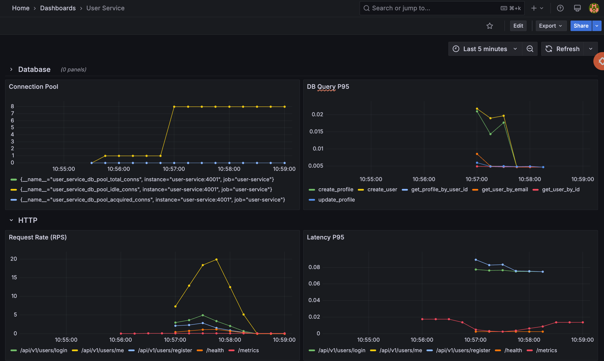
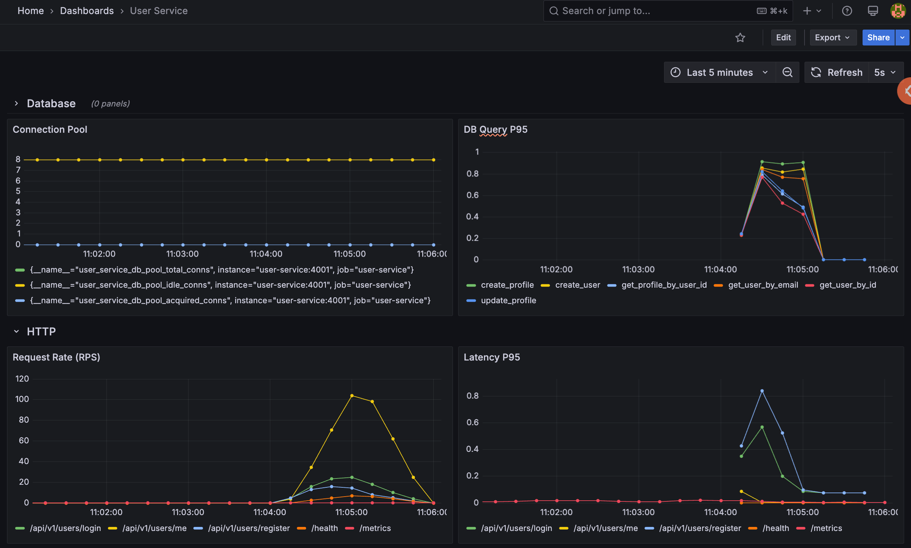
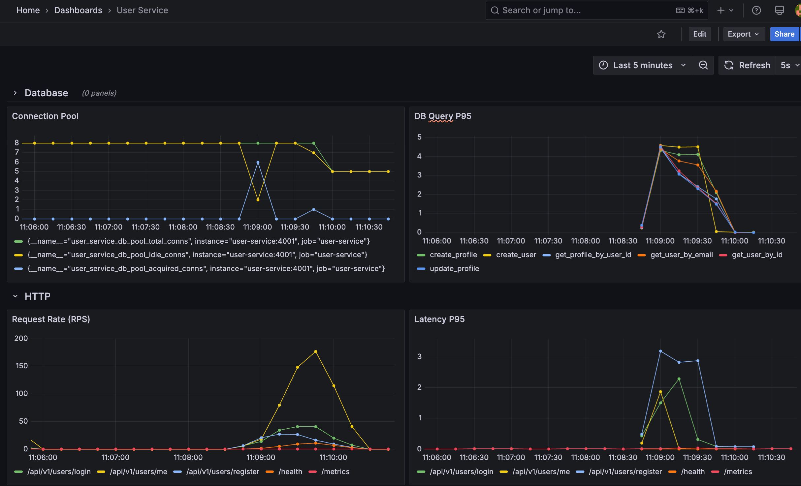

# User Service Load Test

## Workload Model

The load test simulates realistic traffic patterns for a grocery app's user service.

### User Types

| Class | Weight | Think Time | Description |
|---|---|---|---|
| `ReturningUser` | 9 (90%) | 2–5s | Existing user: logs in, reads/updates profile |
| `NewUser` | 1 (10%) | 3–8s | New signup: registers then views profile |

### Request Mix

| Endpoint | Method | ~% of Traffic | Rationale |
|---|---|---|---|
| `/api/v1/users/me` | GET | 60% | Profile reads dominate (settings page, nav bar) |
| `/api/v1/users/login` | POST | 15% | Session starts + token refreshes |
| `/api/v1/users/me` | PUT | 15% | Occasional preference updates |
| `/api/v1/users/register` | POST | 5% | New signups (rare vs returning users) |
| `/health` | GET | 5% | Infrastructure health probes |

### Task Weights (ReturningUser)

| Task | Weight | Per ~19 actions |
|---|---|---|
| `get_profile` | 12 | 12 |
| `update_profile` | 3 | 3 |
| `login` | 3 | 3 |
| `health_check` | 1 | 1 |

## Running the Load Test

### Prerequisites

Start the main stack first:

```bash
docker compose up -d
```

### With Docker (master + workers)

```bash
cd services/user-service/locust

# Start master + 3 workers
docker compose up -d --build

# Scale workers
LOCUST_WORKERS=5 docker compose up -d --scale locust-worker=5
```

Open http://localhost:8089 for the Locust web UI.

### Headless (CLI)

```bash
cd services/user-service/locust

# Baseline: 100 users, ramp 10/sec, 2 min
docker compose run --rm locust-master \
  --master --headless \
  --host=http://user-service:4001 \
  -u 100 -r 10 --run-time 2m

# Or locally with uv
uv sync
uv run locust -f locustfile.py --host http://localhost:4001 \
  --headless -u 100 -r 10 --run-time 2m \
  --csv results/baseline --html results/baseline.html
```

### Test Tiers

| Tier | Users | Ramp Rate | Duration | Purpose |
|---|---|---|---|---|
| Baseline | 100 | 10/s | 1m | Normal operating conditions |
| Moderate | 500 | 25/s | 1m | Peak traffic simulation |
| Stress | 1000+ | 50/s | 1m | Find breaking point |

## Load Test Results

All tests run with Docker (1 master + 5 workers), 1-minute duration, ramp rate matching user count / 20.

### 100 Users (Baseline) — 29.9 RPS

| Endpoint | # Requests | Median | Avg | RPS |
|---|---|---|---|---|
| `GET /api/v1/users/me` | 1,039 | 2ms | 3.2ms | 18.1 |
| `POST /api/v1/users/login` | 314 | 69ms | 73.4ms | 3.3 |
| `PUT /api/v1/users/me` | 239 | 2ms | 4.5ms | 4.9 |
| `POST /api/v1/users/register` | 106 | 65ms | 75.8ms | 2.0 |
| `GET /health` | 74 | 1ms | 1.7ms | 1.6 |
| **Aggregated** | **1,862** | **3ms** | **25.6ms** | **29.9** |

**0 failures. Service handles this comfortably.**



### 500 Users (Moderate) — 146.1 RPS

| Endpoint | # Requests | Median | Avg | RPS |
|---|---|---|---|---|
| `GET /api/v1/users/me` | 4,873 | 1ms | 80ms | 88.1 |
| `POST /api/v1/users/login` | 1,521 | 65ms | 343ms | 20.1 |
| `PUT /api/v1/users/me` | 1,105 | 1ms | 50.5ms | 20.9 |
| `POST /api/v1/users/register` | 505 | 60ms | 219ms | 9.3 |
| `GET /health` | 403 | 1ms | 5.4ms | 7.7 |
| **Aggregated** | **8,857** | **2ms** | **190ms** | **146.1** |

**0 failures. Latencies climbing — login avg 5x slower, setup registration at 1.3s.**



### 1000 Users (Stress) — 288.8 RPS

| Endpoint | # Requests | Median | Avg | RPS |
|---|---|---|---|---|
| `GET /api/v1/users/me` | 7,171 | 2ms | 549ms | 176.8 |
| `POST /api/v1/users/login` | 2,466 | 160ms | 1,600ms | 39.2 |
| `PUT /api/v1/users/me` | 1,604 | 2ms | 300ms | 41.5 |
| `POST /api/v1/users/register` | 743 | 72ms | 948ms | 17.6 |
| `GET /health` | 544 | 1ms | 11.2ms | 13.7 |
| **Aggregated** | **13,428** | **7ms** | **930ms** | **288.8** |

**0 failures, but severe latency degradation across all endpoints.**



### Key Observations

1. **Bcrypt is the bottleneck** — login and register use password hashing; avg latency explodes from ~70ms (100u) → 1.6s (1000u)
2. **Reads stay fast at median** — `GET /users/me` median holds at 1–2ms even at 1000 users, but avg spikes to 549ms due to queuing behind bcrypt-heavy requests
3. **No failures at any tier** — the service degrades gracefully (slower, not broken)
4. **Throughput scales linearly** — 30 → 146 → 289 RPS across tiers
5. **Setup registration** at 1000 users takes 3.8s avg — bcrypt under heavy CPU contention

## Grafana Monitoring

Grafana is available at http://localhost:3333 (admin/admin). Key queries to monitor during load tests:

| Panel | PromQL |
|---|---|
| RPS by route | `sum(rate(user_service_http_requests_total[1m])) by (route)` |
| Latency p95 | `histogram_quantile(0.95, sum(rate(user_service_http_request_duration_seconds_bucket[1m])) by (le, route))` |
| Error rate | `sum(rate(user_service_http_requests_total{status=~"5.."}[1m])) by (route)` |
| In-flight requests | `user_service_http_requests_in_flight` |
| DB query p95 | `histogram_quantile(0.95, sum(rate(user_service_db_query_duration_seconds_bucket[1m])) by (le, operation))` |
| DB errors | `sum(rate(user_service_db_query_errors_total[1m])) by (operation)` |
| Connection pool | `user_service_db_pool_total_conns` / `*_idle_conns` / `*_acquired_conns` |
